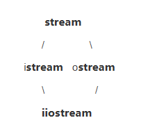
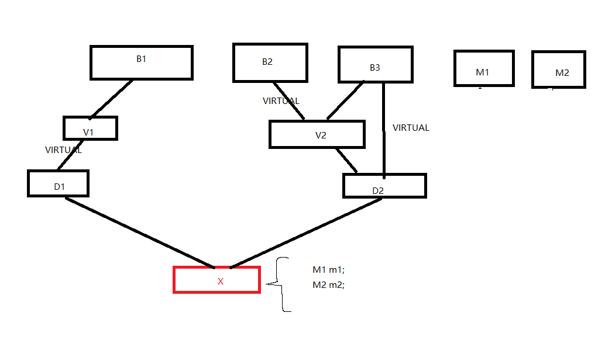
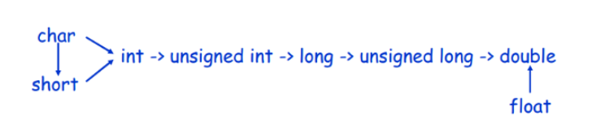

## 1.内存分布

栈：由编译器管理分配和回收，用于存放函数参数，局部变量等等。一般入栈顺序是从右到左入栈。

堆：由程序员自己管理，主要通过new, delete, malloc, free进行分配和回收，空间比较大，但有可能会存在内存泄漏和空闲碎片的情况。

全局/静态区：分为初始化和未初始化两个相邻的区域，存储初始化和未初始化的全局变量和静态变量。

代码区：用于存放程序的二进制代码。

## 2.堆分配内存底层原理

实际上，在分配内存时，系统中有一个空闲的内存链表，当程序员申请时，系统会遍历空闲链表，找到第一个内存空间大于或等于申请的空间分配给程序，一般在分配内存时，也会在内存头部写入内存的大小，目的是方便delete回收。

## 3.new和delete区别

1. new和delete是C++关键字，而malloc和free是C语言库函数。new从自由存储区上分配内存，malloc从堆上分配内存。

2. new/delete会调用构造函数/析构函数对对象进行初始化与销毁：
   
   new在调用时，是先分配内存，再调用构造函数，delete在调用时先使用析构函数，再释放内存，而malloc只分配内存，free只释放内存。故而，new比malloc更安全，因为，他会调用构造和析构函数。

3. 返回值与内存大小计算：
   
   new申请内存不需要计算申请内存的大小，且不需要强制类型转换，其返回的类型就是对应申请类型的指针，而malloc申请时，需要手动计算申请内存的大小，并且还需要强制类型转换为需要的类型，因为malloc返回的类型为 void*。

4. new申请内存失败，返回NULL，而malloc申请内存失败，则返回异常。

## 4.为什么要用new/delete

在C语言中 并没有专门针对于自定义类型使用的内存开辟函数和释放函数 ，有的只是针对于内置类型的函数（malloc、realloc、free），并没有专门给自定义类型使用的函数，所以在我们的C++中有了类和对象的概念之后，自定义类型变得是更加的重要，所以为了专门给自定义类型的内存申请和释放。

## 5.函数参数传递

值传递：形参是实参的拷贝，形参的改变并不影响实参。

指针传递：也是值传递的一种，不过形参接收的是实参的地址，对形参所指对象进行操作，及等价于对实参的操作。

引用传递：实际上就是把引用对象的地址放在了所开辟的栈空间中，函数对其形参的操作可以直接映射到实参上。

指针传递与引用传递的区别：

指针参数传递本质上是值传递，它所传递的是一个地址值。值传递的特点是，被调函数对形式参数的任何操作都是作为局部变量进行的，不会影响主调函数的实参变量的值（形参指针变了，实参指针不会变）。引用传递和指针传递是不同的，虽然他们都是在被调函数栈空间上的一个局部变量，但是任何对于引用参数的处理都会通过一个间接寻址的方式操作到主调函数中的相关变量。

## 6.引用的实质

引用的实质是别名。

引用与指针的区别：

1. 引用必须在定义时初始化，不能修改引用的指向；指针定义式不必初始化，可以改变指针的指向。

2. 可以有 const 指针，但是没有 const 引用。

3. 指针可以有多级，但是引用只能有一级。

4. 对指针使用 ++ 表示指向下一份数据，对引用使用 ++ 表示它所指代的数据本身加 1。

5. sizeof()大小不同，指针一般是四个字节，引用是数据类型的大小。

## 7.指针和数组区别

数组是用于存储多个相同类型的数据集合，数组名是首元素的地址，sizeof的大小是所有元素总大小。

指针：相当于一个变量，存储的是内存中的地址，sizeof的大小固定。

区别：同类型的指针可以相互赋值，而数组不行，数组只能一个一个元素的赋值或拷贝。

## 8.函数指针与指针函数

函数指针是一个指向函数的指针，指向函数的入口地址；而指针函数只是说明他是一个返回值为指针的函数。

## 9.野指针、悬挂指针

野指针：就是没有经过初始化的指针。

悬挂指针：就是最初指向的内存被释放后，未被置空的指针。

避免：对于野指针的避免，就是在定义指针后且在使用之前对指针进行初始化，或用智能指针。对于悬挂指针的避免，就是在内存释放后，即使的吧指针置空或调用智能指针。

## 10.常量指针与指针常量

```cpp
const  int  *p = &a 
//常量指针，指向可以改，但指向的值不可以改。
int  * const p = &a 
//指针常量，指向不可以改，但指向的值可以改
```

## 11.static

1. static修饰局部变量：局部变量一般存放在栈区，且局部变量的生命周期在所包含的语句块结束后而结束。通过static修饰后的局部变量存放在静态区，生命周期会一直延续到整个程序执行结束后而结束，但其作用域未发生改变。

2. static修饰全局变量：全局变量，一般存放在全局区，能够被整个程序所访问到，同时也能被同一个工程中的其他源文件所访问到（但是需添加extern声明）。通过static修饰过后，则该全局变量存放在静态区，且也改变了该变量的作用域，通过static修饰后，该全局变量只能在本文件中被访问到，而其他文件访问不到。

3. static修饰函数：与修饰全局变量一样，改变了其作用域。

4. static修饰类成员函数：如果类中的某个成员函数被static所修饰，那么该成员函数不属于该类的任何一个对象，他属于整个类，所有对象共享同一个函数，因此不包含this指针。同时该函数也只能访问类中的静态变量，而不能访问其他成员变量和成员函数。

5. static修饰类成员变量：如果static修饰类中的成员变量，那么该变量就归所有的对象，存储空间中也只有一个副本，所有对象共享同一份数据，可以通过类或对象直接进行调用。

## 12.const

1. const修饰基本数据类型：使得这些变量变为常量，其值不可更改。

2. 常量指针、指针常量。

3. const修饰成员变量：const修饰的成员变量的初始化只能在构造函数中使用列表初始化。

4. const修饰成员函数：在成员函数后加const，表示就是成员函数不可以更改成员变量，如果需要修改某个变量，将变量声明为mutable。
   
   ```cpp
   int a() const;
   ```

5. const修饰类：定义常量对象，常量对象只能调用常量函数，不可以调用其他函数。

## 13.mutable

mutable也是为了突破const的限制而设置的。被mutable修饰的变量，将永远处于可变的状态，即使在一个const函数中。

## 14. volatile

表示对象会被当前执行的代码流之外的东西所修改，变量被volatile修饰的时候，编译器在读取该变量的值时，每次都会去内存地址中重拿一次。而且读取的数据立刻被保存。

问题：

```cpp
volatile int i=10;
int a = i;
...
// 其他代码，并未明确告诉编译器，对 i 进行过操作
int b = i;
```

由于编译器发现两次从 i读数据的代码之间的代码没有对 i 进行过操作，它会自动把上次读的数据放在 b 中。而不是重新从 i 里面读。如果 i是一个寄存器变量或者表示一个端口数据就容易出错。

应用场景：中断、多任务、存储器映射寄存器。

## 15. #define与const区别

1. 类型和安全检查不同：宏定义只是字符的替换，没有数据类型的区别，同时这种替换也没有类型安全检查，而const常量是常量的声明，有数据类型的区别，同时在编译阶段也会有类型的检查。

2. 编译器处理的不同：宏是一个“编译时”概念，编译器在预处理阶段就把宏给展开，不能对宏进行调试；而const是一个“运行时”概念，编译器在编译阶段处理const变量，类似于一个只读数据。

3. 存储方式的不同：宏定义是直接替换，没有内存分配，存储于代码段中；而const常量有内存分配，存储于数据段中。

4. 定义域不同：宏定义是全局定义，可以在整个程序中使用，而const是一个局部定义，只能在定义的地方使用。

## 16.c和c++区别

1. 语法上：语法上C++的区别有头文件和命名空间的不同，C++允许我们自定义自己的空间，而C不可以；在关键字方面也有不同，如C++在动态内存管理上增加了new和delete，在指针上，C++增加了引用的概念，C++在关键字上，也还增加了auto类型等等。

2. 函数上：C++支持函数重载，而C不支持。

3. struct上：C的struct像是一个数据结构的集合，而C++的struct不仅成员函数，还有成员变量，同时还增加了访问权限的概念。

4. C是面向过程的语言，而C++是面向对象的语言，C++在C的基础上最大的变化就是增加了类的概念。

## 17.c++ struct和class区别

主要的区别在于默认访问权限和默认继承权限不同，struct的默认访问权限和默认继承权限都是public，而class是private。

## 18.构造函数与析构函数

当程序员不定义构造/析构函数时，系统默认提供的函数，函数体为空。

程序员可以自定义有参/无参构造，此时系统不再提供构造函数。

程序员可以自定义析构函数(必定无参)，此时系统不再提供析构函数。

## 19.编译器提供的默认函数

构造函数`A();` 

拷贝构造函数`A(const A&);`

析构函数`~A();`

重载`A& operator = (const A&);`

重载`A* operator & ();`

重载`const A* operator & () const;`

移动构造`A(A&&);`

移动赋值`A& operator = (const A&&);`

如果想屏蔽这些默认函数，可在后加=delete

如果定义了构造函数，又想使用默认提供的无参构造函数，可在后面加=default

## 20.重载与覆盖(重写)

覆盖(重写)是在类中，子类重写从基类继承过来的函数，函数名、返回值、参数列表都必须和基类相同。重写的一定是虚函数。

重载指允许在相同作用域中存在多个同名的函数，这些函数的参数表不同。返回值不能触发重载，在声明后加const可以触发重载。

另：重定义

重定义指在派生类中，重新定义和父类名字相同的非virtual函数，其参数列表和返回值都可以不同。则父类中的同名函数被子类所隐藏，如果想要调用父类中的同名函数，则需要加上父类的作用域。

## 21.构造和析构顺序

构造顺序：

1. 调用父类的构造函数

2. 调用成员变量的构造函数

3. 调用类自身的构造函数

4. 对于虚继承，看下这一段经典代码
   
   ```cpp
   class stream
   {
   public:
       stream(){cout<<"stream::stream()!"<<endl;}
   };
   
   class iistream:virtual stream
   {
   public:
       iistream(){cout<<"istream::istream()!"<<endl;}
   };
   
   class oostream:virtual stream
   {
   public:
       oostream(){cout<<"ostream::ostream()!"<<endl;}
   };
   
   class iiostream:public iistream,public oostream
   {
   public:
       iiostream(){cout<<"iiostream::iiostream()!"<<endl;}
   };
   
   int main(int argc, const char * argv[])
   {
       iiostream oo;
   ｝
   ```
   
   继承结构：
   
   
   
   显然，打印
   
   stream::stream()!
   
   istream::istream()!
   
   ostream::ostream()!
   
   iiostream::iiostream()!
   
   最上层派生类的构造函数负责调用虚基类子对象的构造函数。所有虚基类子对象会按照深度优先、从左到右的顺序进行初始化。
   
   再看一段经典代码
   
   ```cpp
   class B1
   {
   public:
       B1(){cout<<"B1::B1()!<"<<endl;}
       void f() {cout<<"i'm here!"<<endl;}
   };
   
   class V1: public B1
   {
   public:
       V1(){cout<<"V1::V1()!<"<<endl;}
   };
   
   class D1: virtual public V1
   {
   public:
       D1(){cout<<"D1::D1()!<"<<endl;}
   };
   
   class B2
   {
   public:
       B2(){cout<<"B2::B2()!<"<<endl;}
   };
   
   class B3
   {
   public:
       B3(){cout<<"B3::B3()!<"<<endl;}
   };
   
   class V2:public B1, public B2
   {
   public:
       V2(){cout<<"V2::V2()!<"<<endl;}
   };
   
   class D2:virtual public V2, public B3
   {
   public:
       D2(){cout<<"D2::D2()!<"<<endl;}
   };
   
   class M1
   {
   public:
       M1(){cout<<"M1::M1()!<"<<endl;}
   };
   
   class M2
   {
   public:
       M2(){cout<<"M2::M2()!<"<<endl;}
   };
   
   class X:public D1, public D2
   {
       M1 m1;
       M2 m2;
   };
   int main(int argc, const char * argv[])
   {
       X x;
   ｝
   ```
   
   问打印顺序：
   
   **B1::B1()!<**
   
   **V1::V1()!<**
   
   **B1::B1()!<**
   
   **B2::B2()!<**
   
   **V2::V2()!<**
   
   **D1::D1()!<**
   
   **B3::B3()!<**
   
   **D2::D2()!<**
   
   **M1::M1()!<**
   
   **M2::M2()!<**
   
   解析：
   
   
   
   继承关系如图，
   
   1. x继承D1,D2，按先后顺序先构造D1，根据继承顺序，先父类后子类，依次构造B1,V1,D1。
   
   2. 再构造D2，根据继承顺序，先父类后子类，先构造B2，再优先构造B2的虚基类子对象，再构造构造B3，再构造B3的虚基类子对象，再调用D2构造函数。
   
   3. X的成员对象M1,M2，最后构造X。

析构顺序：与构造顺序相反。

## 22.面向对象三大特性

封装：对客观事物封装成抽象的类，并且可以自定义成员变量，和操作这些成员变量的方法，同时可以对这些成员变量和方法加以不同的权限，控制类对象和外界对象对其的访问。

继承：指某个对象可以获取另一个对象的属性和方法，可以无需重新编译源对象属性和方法，同时加以使用。通过继承所创建的类被称为“子类”或“派生类”，而被继承的类叫做“基类”或“父类”。

多态：多态分为静态多态和动态多态，静态多态主要是指函数重载或运算符重载，而动态多态主要指子类重写父类中的函数。作用：可以大大的提高程序的复用性，同时可以提高代码的扩充性和可维护性。

## 23.虚继承底层原理

虚继承中，子类继承的是虚基类指针，指向的是一份虚基类表，如果父类也有虚继承，那么子类也继承父类的虚基类指针。

例：菱形继承问题，子类一共有三个虚基类指针，两个指向父类，一个指向祖父类。

虚函数表：当一个类中定义有虚函数时，其该类将生成一个虚函数表，和一个虚函数指针。虚函数表中存放的是虚函数的地址（顺序为声明的顺序），其最后的位置存放的是NULL（所以虚表的大小比虚函数多一个）；（虚函数指针是从属于类的，所以虚函数指针的大小是计算在类上面的）。

当子类继承定义了虚函数的父类时，如果子类不重写虚函数，子类虚函数指针指向父类虚函数表。如果子类重写虚函数，子类单独生成一张虚函数表，虚函数指针指向这个表，未重写的函数地址与基类函数地址相同，重写的函数地址覆盖基类虚函数地址。

如果子类有增加虚函数，那么新增的虚函数地址将追加到虚函数表尾端。

一个类只有一张虚函数表，所有类的对象共享一张虚函数表。在编译期间确定虚函数表。

多继承时，子类中有多个虚函数表和多个虚函数指针。

大小计算问题：

一个虚函数表指针占用4个字节。

虚函数表指针在类的最前面。

## 24.类大小计算问题

空类：1字节。

C++标准指出，不允许一个对象（当然包括类对象）的大小为0，不同的对象不能具有相同的地址。这是由于new需要分配不同的内存地址，不能分配内存大小为0的空间 ，避免除以 sizeof(T)时得到除以0错误 ，故使用一个字节来区分空类。

一个类包含空类对象：4字节。

字节对齐。

有虚函数表的类：数据成员大小+指针大小。

有虚函数指针。

字节对齐：数据的起始地址是该数据类型大小的倍数。

手动修改字节对齐：可以通过#pragma pack(1)来强制struct不增加填充，pack(n)的值必须是2的指数，比如n可以是1,2,4等。


## 25.哪些函数不能是虚函数

构造函数，内联函数，静态函数，友元函数，普通函数。


## 26.析构函数为什么要声明为虚函数

防止内存泄漏：当子类中存在成员变量在堆区申请内存空间时，基类指针指向子类对象时，在对象使用完毕后准备销毁时，如果基类析构函数没有定义成虚函数，那么编译器根据指针类型就会认为当前对象为基类，从而调用基类的析构函数，而不调用子类的析构函数，从而造成内存泄漏。如果基类把析构函数定义为虚函数后，基类指针在调用析构函数时，就会调用子类的析构函数之后再调用基类的析构函数，从而成功释放内存。


## 27.什么是抽象类，什么是纯虚函数

纯虚函数：无函数体，后加=0.

```cpp
virtual void Display () = 0;
```

当类中存在纯虚函数时，那么该类就被定义为抽象类，抽象类不可实例化对象，子类必须重写父类的纯虚函数，否则子类也为抽象类。声明纯虚函数的目的是，为了让子类只继承父类的函数接口。


## 28.深拷贝与浅拷贝

浅拷贝：当类对象在赋值时，将自动调用拷贝构造函数，拷贝构造函数将会对类成员一一的做等号复制。

深拷贝：当类中有指针类型的成员时，如果再做浅拷贝，那里两个类中的两个指针变量指向同一个地址，当两个类在销毁时，都会释放指针所指向的内存，那么就会存在同一块内存重复释放的问题，这时就需要我们自定义拷贝构造函数，我们需要在堆区重新申请一块内存，用来存放数据，这时在两个对象销毁时，就不会产生内存重复释放的问题。


## 29.拷贝构造

调用拷贝构造的时机：

当类对象以值传递的形式作为函数参数时；

当类对象以值的形式作为返回值时；

当类对象初始化另一个对象时。

拷贝构造：

```cpp
A(const A & a){}
```

为什么要用引用传参：假如用值传参，在传参时会调用拷贝函数，形成循环调用。


## 30.内存泄漏

可能的原因：

1. 指针重新赋值。

2. 错误释放内存，例如链表。

3. 内存分配后忘记释放。

4. 没有正确处理指针类型的函数返回值。

如何避免：

1. 用前检查。

2. malloc与free对应，new与delete对应。

3. 分配内存后初始化。

检测：valgrind工具。

注：valgrind不检查静态数组。


## 31.inline内联函数

内联函数和普通函数的区别在于：当编译器处理调用内联函数的语句时，不会将该语句编译成函数调用的指令，而是直接将整个函数体的代码插入调用语句处，就像整个函数体在调用处被重写了一遍一样。

注意：

内联函数不能有循环等复杂语句。

调用内联函数的语句前必须已经出现内联函数的定义。

inline声明只是建议编译器使用内联，虚函数和递归函数即使被声明为内联，编译器也不会做内联处理。


## 32.#define与typedef区别

1. 作用时间不一样，#define是在预处理阶段进行文本替换，而typedef是在编译阶段替换。

2. 类型检查上不一样，#define没有类型检查，而tepydef有类型检查.

3. 功能上：#define只是单纯的文本替换，可以给类型取别名，也可以定义其他变量、函数等等，而typedef只能给类型取别名。

4. 作用域不同：#define在整个程序中都能使用，而typedef只有在定义的语句块内使用。


## 33.c++右值引用

1. 左值与右值的区别
   
   左值是可以放在赋值号左边可以被赋值的值，在内存中有实体。
   
   右值在赋值号右边取出值赋给其他变量的值，可以在内存或寄存器中。
   
   左值可以被修改，右值不能。
   
   一个对象被当作左值时，使用它的地址；当作右值时，使用它的值。

2. 语法
   
   左值：
   
   ```cpp
   int a = 10;
   int &x = a;//a是左值
   int &&y = 10;//10是右值
   ```

3. move()
   
   std::move并不能移动任何东西，它唯一的功能是将一个左值强制转化为右值引用，继而可以通过右值引用使用该值，以用于移动语义。
   
   C++ 标准库使用比如vector::push_back 等这类函数时,会对参数的对象进行复制,连数据也会复制.这就会造成对象内存的额外创建, 本来原意是想把参数push_back进去就行了,通过std::move，可以避免不必要的拷贝操作。
   
   std::move是将对象的状态或者所有权从一个对象转移到另一个对象，只是转移，没有内存的搬迁或者内存拷贝。
   
   ```cpp
   string str1 = "123";
   string str2 = std::move(str1);
   //此时str1变成空字符串
   ```
   
   

## 34.四大类型转换

1. dynamic_cast
   
   ```cpp
   //将expression转换为type类型.
   dynamic_cast<type>(expression);
   ```
   
   用于将基类的指针或引用安全地转换成派生类的指针或引用，dynamic_cast在运行期间强制转换，运行时进行类型转换检查。
   
   也就是说，将基类转换为派生类时，有安全检查。
   
   对指针进行转换，失败返回null，成功返回type类型的对象指针，对于引用的转换，失败抛出一个`bad_cast` ，成功返回type类型的引用。
   
   用于类的转换，基类中一定要有virtual定义的虚函数（保证多态性），不然会编译错误。
   
   不能用于内置类型转换。

2. static_cast
   
   ```cpp
   //与dynamic_cast作用类似，将expression转换为type类型，区别在于
   //static发生于编译时，dynamic发生于运行时。 
   static_cast<type>(expression);
   
   ```
   
   用于类层次结构中基类和派生类之间指针或引用的转换，其中向上转换是安全的，向下转换是不安全的。
   
   解释：将派生类转换为基类安全，将基类转换为派生类不安全。
   
   可以用于内置类型转换。丢失的精度由使用者负责。正确转换方向如下。
   
   
   
   static_cast不能转换const/volitale类型。

3. const_cast
   
   ```cpp
   //弥补了static_cast无法转换const/volitale的不足，
   //将expression的const/volitale属性移除，仅限于底层const属性. 
   const_cast<type>(expression);
   
   
   ```
   
   const_cast不能执行其他任何类型转换，只能用于同类型之间不同`const/ volitale`属性的移除(通常是指针或引用，而不是内置类型)。否则会报编译时错误。
   
   只能移除底层const的const属性。
   
   什么是底层const：表示指针所指向的对象是个常量。

4. reinterpret_cast
   
   ```cpp
   //reinterpret_cast 允许将任何指针转换为任何其他指针类型。
   // 也允许将任何整数类型转换为任何指针类型以及反向转换。 
   reinterpret_cast<type>(expression);
   
   
   ```
   
   转换不相关类型。
   
   本质作用是重新定义内存数据的解释方式，而不进行任何二进制转换。
   
   安全性低，不推荐使用。
