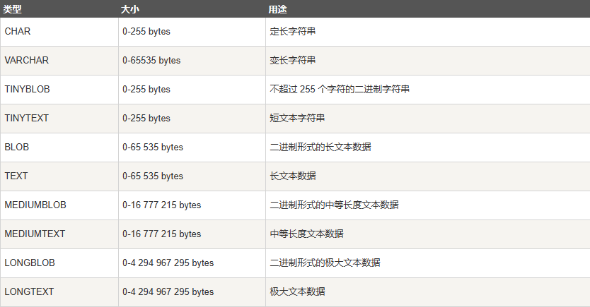

# 1.建立连接

```
#mysql连接
mysql -u root -p password
# 退出
exit
```

# 2.数据库操作

```
#操作
CREATE DATABASE 数据库名;
#删除
drop database <数据库名>;
#选择
use <数据库名>;
```

# 3.mysql数据类型

## 3.1基本数据类型


## 3.2日期和时间


## 3.3字符串类型



# 4.数据库表操作

```
创建
CREATE TABLE table_name (column_name column_type, ... );
#可用AUTO_INCREMENT定义列的自增属性，用PRIMARY KEY声明主键
#删除
DROP TABLE table_name ;
#插入
INSERT INTO table_name ( field1, field2,...fieldN )
                       VALUES
                       ( value1, value2,...valueN );
#查询
SELECT column_name,column_name
FROM table_name
[WHERE Clause]
[LIMIT N][ OFFSET M]
#更新
UPDATE table_name SET field1=new-value1, field2=new-value2
[WHERE Clause]
#删除
DELETE FROM table_name [WHERE Clause]
```

# 5.查询详解

## 5.1where子句

```
SELECT field1, field2,...fieldN FROM table_name1, table_name2...
[WHERE condition1 [AND [OR]] condition2.....
```

where子句可以指定任何条件，可以用AND/OR连接。

## 5.2like子句

```
SELECT field1, field2,...fieldN 
FROM table_name
WHERE field1 LIKE condition1 [AND [OR]] filed2 = 'somevalue'
```

可以在where子句中使用like子句，单独使用时等同于"="。like还可以与通配符%配合使用，类似于正则表达式。

## 5.3union

UNION 操作符用于连接两个以上的 SELECT 语句的结果组合到一个结果集合中。

可以添加参数DISTINCT/ALL，前者不保留重复数据，后者保留重复数据。

```
SELECT expression1, expression2, ... expression_n
FROM tables
[WHERE conditions]
UNION [ALL | DISTINCT]
SELECT expression1, expression2, ... expression_n
FROM tables
[WHERE conditions];
```

## 5.4order by排序

```
SELECT field1, field2,...fieldN FROM table_name1, table_name2...
ORDER BY field1 [ASC [DESC][默认 ASC]], [field2...] [ASC [DESC][默认 ASC]]
```

ASC递增，DESC递减。

## 5.5group by 分组

```
SELECT column_name, function(column_name)
FROM table_name
WHERE column_name operator value
GROUP BY column_name;
```

根据一个或多个列对结果集进行分组。

## 5.6多表查询

- **INNER JOIN（内连接,或等值连接）**：获取两个表中字段匹配关系的记录。
- **LEFT JOIN（左连接）：** 获取左表所有记录，即使右表没有对应匹配的记录。
- **RIGHT JOIN（右连接）：** 与 LEFT JOIN 相反，用于获取右表所有记录，即使左表没有对应匹配的记录。


## 5.7null查询

- **IS NULL:** 当列的值是 NULL,此运算符返回 true。
- **IS NOT NULL:** 当列的值不为 NULL, 运算符返回 true。
- **<=>:** 比较操作符（不同于 = 运算符），当比较的的两个值相等或者都为 NULL 时返回 true。(注意这是一个整体)

# 6.事务语句

```
#开始
BEGIN / START TRANSACTION
#提交
COMMIT
#回滚
ROLLBACK / ROLLBACK TO identifier 
#创建保存点
SAVEPOINT identifier
#删除保存点
RELEASE SAVEPOINT identifier
#设置隔离级别
SET TRANSACTION
```

# 7.修改表字段

```
#删除字段
ALTER TABLE testalter_tbl  DROP i;
#添加字段
ALTER TABLE testalter_tbl ADD i INT;
#如果要精确到字段在表中位置，在最后加如下关键字
#加到第一位
ALTER TABLE testalter_tbl ADD i INT FIRST;
#加到c字段后面
ALTER TABLE testalter_tbl ADD i INT AFTER c;

#修改字段类型
ALTER TABLE testalter_tbl MODIFY c CHAR(10);
#修改字段名和类型
ALTER TABLE testalter_tbl CHANGE i j BIGINT;
```

# 8.索引

```
#创建索引
CREATE INDEX indexName ON table_name (column_name)
#添加索引
ALTER table tableName ADD INDEX indexName(columnName)
#删除
DROP INDEX [indexName] ON mytable; 
```

添加UNIQUE则为唯一索引，索引列的值必须唯一，但允许有空值。如果是组合索引，则列值的组合必须唯一。
