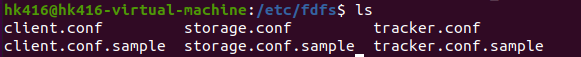
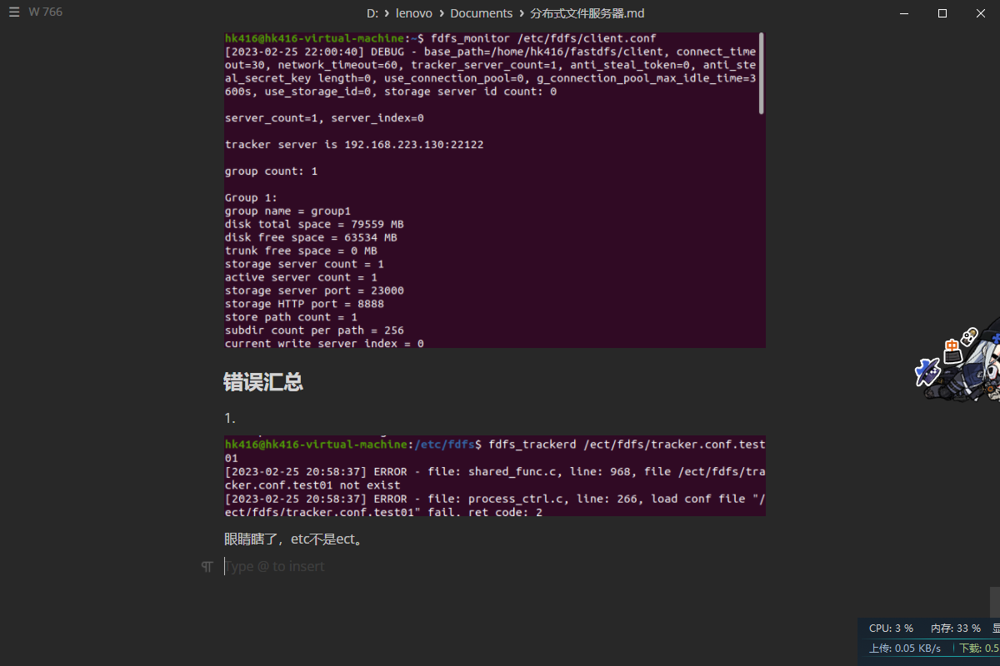

# fastdfs配置

## fastdfs追踪器配置

配置文件默认位置：/etc/fdfs



复制一份tracker.conf.sample，保存为后缀tracker.conf。

```
#注意权限
sudo gedit tracker.conf
```


第八行bind_addr: 将追踪器和主机进行绑定，用ifconfig查看主机ip地址


bind-addr填入192.168.223.130

如果不指定，fdfs也会自动绑定主机ip地址，所以不改也行。

第11行port是追踪器监听的端口，这是存储节点的端口。默认22122，可以自行修改。

第22行base_path是给追踪器准备的日志目录，存储日志文件和pid文件（储存追踪器的pid）。目前这个目录并不存在，我们需要创建一个。

```
#自行选择路径
cd /home/hk416
mkdir fastdfs
cd fastdfs
#顺便创建存储节点和客户端的日志文件夹
mkdir tracker storage client
```

修改base_path为   /home/hk416/fastdfs/tracker

## 存储节点配置文件

基本上和追踪器的修改相同


group_name表示存储节点属于哪个组。

bind_addr可以不写，自动配置。

port是存储节点绑定的端口，给客户端准备的。

base_path修改同上，修改为  /home/hk416/fastdfs/storage

第105行storage_path_count  存放用户上传文件的路径个数。


第109行store_pathi表示第i个存储路径，个数要与storage_path_count一致，我们修改为    /home/hk416/fastdfs/storage

第118行是追踪器ip和端口


要修改成和追踪器相同 192.168.223.130。即使前面没写，它也应该是主机的ip。

## 客户端配置文件

基本同上


base_path 修改为 /home/hk416/fastdfs/client

注意，用户要对该路径有读写权限。

```
给所有用户加上写权限
sudo chmod a+w client
```

修改tracker_server同上

补充：对于追踪器集群，要配置多个追踪器地址，这样写即可：


ip地址必须不同，用于区分，端口可以相同。

# fastdfs的启动

## 追踪器的启动

先到/usr/bin路径下查看fdfs相关文件


其中fdfs_tracked就是启动文件。

```
# 启动(路径写自己的追踪器文件所在位置)
fdfs_trackerd /etc/fdfs/tracker.conf
# 关闭
fdfs_trackerd /etc/fdfs/tracker.conf stop
# 重启
fdfs_trackerd /etc/fdfs/tracker.conf restart
```

## 存储节点的启动

基本同上

```
# 启动(路径写自己的存储节点文件所在位置)
fdfs_storaged /etc/fdfs/storage.conf
# 关闭
fdfs_storaged /etc/fdfs/storage.conf stop
# 重启
fdfs_storaged /etc/fdfs/storage.conf restart
```

```
#验证是否启动
ps aux|grep fdfs_*
```


这就算启动了。第一个是追踪器，第二个是存储节点。

## 客户端上传与下载

```
# 上传
fdfs_upload_file /etc/fdfs/client.conf <要上传的文件>
# 下载
fdfs_download_file /etc/fdfs/client.conf <文件id（上传后返回的字符串）>
```


注意保存返回的字符串，下载文件时要用到。

```
group1/M00/00/00/wKjfgmP6EMeAGldBAAAAEx6MsD0359.txt
```

我们现在去 /home/hk416/fastdfs/storage/data/00/00 找存放的文件。


上传的文件会被重命名，这是为了保证唯一性。


下载的文件.

打开看看


成功。

## fdfs状态检测

```
# 查看
fdfs_monitor /etc/fdfs/client.conf
# 从集群中删除错误存储节点
fdfs_monitor /etc/fdfs/client.conf delete <组名+ip>
```


## 错误汇总

1.


眼睛瞎了，etc不是ect。


