# fastdfs配置

## fastdfs追踪器配置

配置文件默认位置：/etc/fdfs


复制一份tracker.conf.sample，保存为后缀tracker.conf。

```
#注意权限
sudo gedit tracker.conf
```

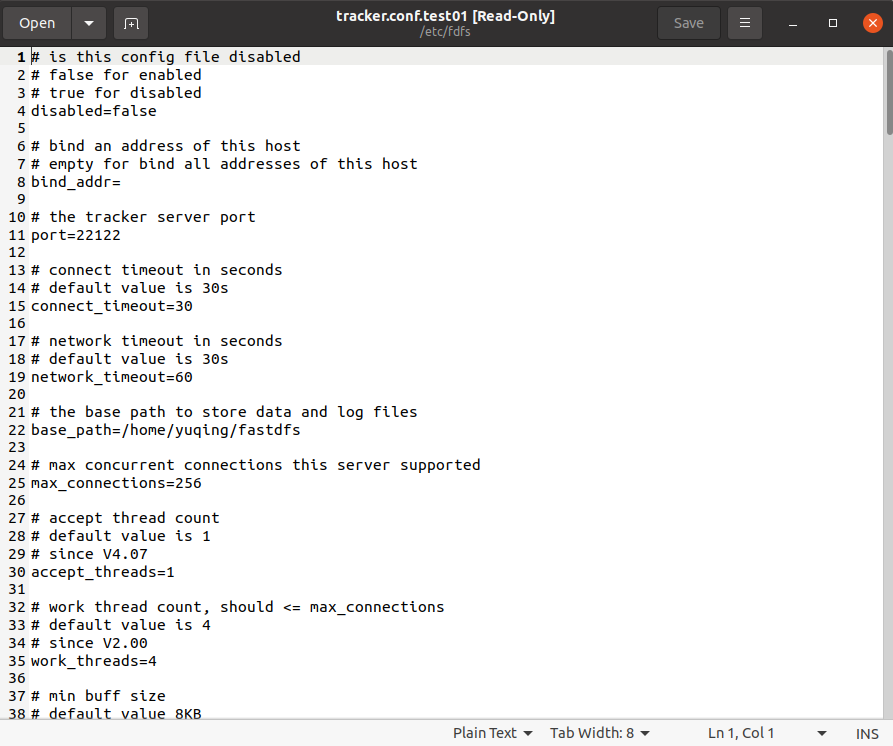

第八行bind_addr: 将追踪器和主机进行绑定，用ifconfig查看主机ip地址

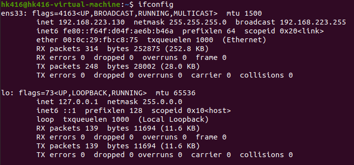

bind-addr填入192.168.223.130

如果不指定，fdfs也会自动绑定主机ip地址，所以不改也行。

第11行port是追踪器监听的端口，这是存储节点的端口。默认22122，可以自行修改。

第22行base_path是给追踪器准备的日志目录，存储日志文件和pid文件（储存追踪器的pid）。目前这个目录并不存在，我们需要创建一个。

```
#自行选择路径
cd /home/hk416
mkdir fastdfs
cd fastdfs
#顺便创建存储节点和客户端的日志文件夹
mkdir tracker storage client
```

修改base_path为   /home/hk416/fastdfs/tracker

## 存储节点配置文件

基本上和追踪器的修改相同

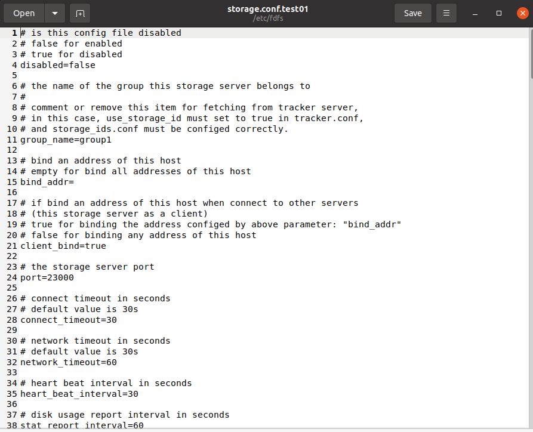

group_name表示存储节点属于哪个组。

bind_addr可以不写，自动配置。

port是存储节点绑定的端口，给客户端准备的。

base_path修改同上，修改为  /home/hk416/fastdfs/storage

第105行storage_path_count  存放用户上传文件的路径个数。

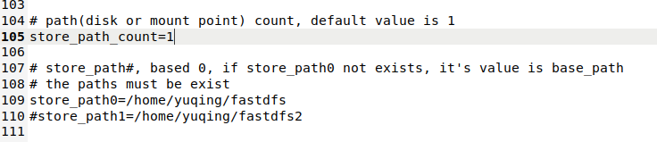

第109行store_pathi表示第i个存储路径，个数要与storage_path_count一致，我们修改为    /home/hk416/fastdfs/storage

第118行是追踪器ip和端口

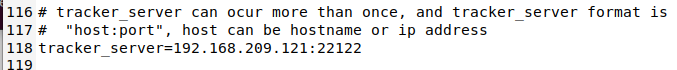

要修改成和追踪器相同 192.168.223.130。即使前面没写，它也应该是主机的ip。

## 客户端配置文件

基本同上

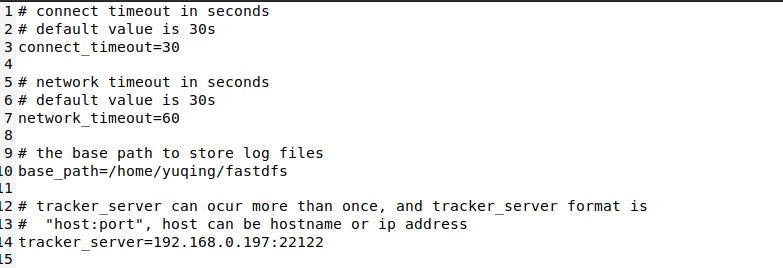

base_path 修改为 /home/hk416/fastdfs/client

注意，用户要对该路径有读写权限。

```
给所有用户加上写权限
sudo chmod a+w client
```

修改tracker_server同上

补充：对于追踪器集群，要配置多个追踪器地址，这样写即可：


ip地址必须不同，用于区分，端口可以相同。

# fastdfs的启动

## 追踪器的启动

先到/usr/bin路径下查看fdfs相关文件

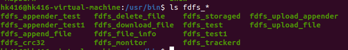

其中fdfs_tracked就是启动文件。

```
# 启动(路径写自己的追踪器文件所在位置)
fdfs_trackerd /etc/fdfs/tracker.conf
# 关闭
fdfs_trackerd /etc/fdfs/tracker.conf stop
# 重启
fdfs_trackerd /etc/fdfs/tracker.conf restart
```

## 存储节点的启动

基本同上

```
# 启动(路径写自己的存储节点文件所在位置)
fdfs_storaged /etc/fdfs/storage.conf
# 关闭
fdfs_storaged /etc/fdfs/storage.conf stop
# 重启
fdfs_storaged /etc/fdfs/storage.conf restart
```

```
#验证是否启动
ps aux|grep fdfs_*
```

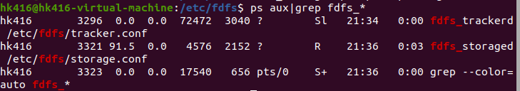

这就算启动了。第一个是追踪器，第二个是存储节点。

## 客户端上传与下载

```
# 上传
fdfs_upload_file /etc/fdfs/client.conf <要上传的文件>
# 下载
fdfs_download_file /etc/fdfs/client.conf <文件id（上传后返回的字符串）>
```

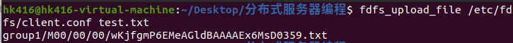

注意保存返回的字符串，下载文件时要用到。

```
group1/M00/00/00/wKjfgmP6EMeAGldBAAAAEx6MsD0359.txt
```

我们现在去 /home/hk416/fastdfs/storage/data/00/00 找存放的文件。


上传的文件会被重命名，这是为了保证唯一性。

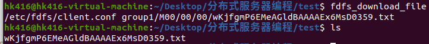

下载的文件.

打开看看


成功。

## fdfs状态检测

```
# 查看
fdfs_monitor /etc/fdfs/client.conf
# 从集群中删除错误存储节点
fdfs_monitor /etc/fdfs/client.conf delete <组名+ip>
```

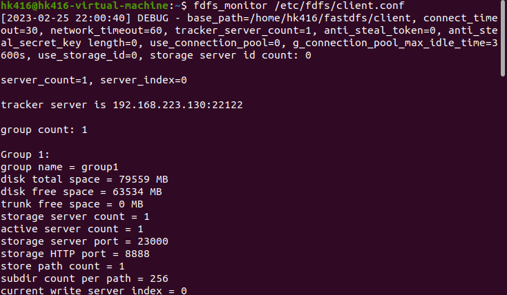

## 如何修改上传和下载程序

将upload程序修改成接口

复制一份 fdfs_upload_file.c

fdfs_upload_file.c

```
#include <stdio.h>
#include <stdlib.h>
#include <string.h>
#include <errno.h>
#include <sys/types.h>
#include <sys/stat.h>
#include "fdfs_client.h"
#include <fcntl.h>
#include <sys/wait.h>
//#include "logger.h"
/*
static void usage(char *argv[])
{
    printf("Usage: %s <config_file> <local_filename> " \
        "[storage_ip:port] [store_path_index]\n", argv[0]);
}
*/

int upload_file1(const char* confFile, const char* myFile,char *fileID )
{
//    char *conf_filename;
//    char *local_filename;
    char group_name[FDFS_GROUP_NAME_MAX_LEN + 1];
    ConnectionInfo *pTrackerServer;
    int result;
    int store_path_index;
    ConnectionInfo storageServer;
//    char file_id[128];
/*
    if (argc < 3)
    {
        usage(argv);
        return 1;
    }
*/

/*
//log
    log_init();
    g_log_context.log_level = LOG_ERR;
    ignore_signal_pipe();
*/
//    conf_filename = argv[1];

    if ((result=fdfs_client_init(confFile)) != 0)
    {
        return result;
    }


    pTrackerServer = tracker_get_connection();
    if (pTrackerServer == NULL)
    {
        fdfs_client_destroy();
        return errno != 0 ? errno : ECONNREFUSED;
    }

//    local_filename = argv[2];
    *group_name = '\0';
/*    if (argc >= 4)
    {
        const char *pPort;
        const char *pIpAndPort;

        pIpAndPort = argv[3];
        pPort = strchr(pIpAndPort, ':');
        if (pPort == NULL)
        {
            fdfs_client_destroy();
            fprintf(stderr, "invalid storage ip address and " \
                "port: %s\n", pIpAndPort);
            usage(argv);
            return 1;
        }

        storageServer.sock = -1;
        snprintf(storageServer.ip_addr, sizeof(storageServer.ip_addr), \
             "%.*s", (int)(pPort - pIpAndPort), pIpAndPort);
        storageServer.port = atoi(pPort + 1);
        if (argc >= 5)
        {
            store_path_index = atoi(argv[4]);
        }
        else
        {
            store_path_index = -1;
        }
    }
    else */if ((result=tracker_query_storage_store(pTrackerServer, \
                    &storageServer, group_name, &store_path_index)) != 0)
    {
        fdfs_client_destroy();
        fprintf(stderr, "tracker_query_storage fail, " \
            "error no: %d, error info: %s\n", \
            result, STRERROR(result));
        return result;
    }

    result = storage_upload_by_filename1(pTrackerServer, \
            &storageServer, store_path_index, \
            myFile, NULL, \
            NULL, 0, group_name, fileID);
    if (result == 0)
    {
        printf("%s\n", fileID);
    }
    else
    {
        fprintf(stderr, "upload file fail, " \
            "error no: %d, error info: %s\n", \
            result, STRERROR(result));
    }

    tracker_disconnect_server_ex(pTrackerServer, true);
    fdfs_client_destroy();

    return result;
}
//mutiprocess
int upload_file2(const char* confFile, const char* upload_file, char *fileID, int size){
    //init pipe
    int fd[2];
    int ret = pipe(fd);
    if(ret==-1){
        perror("pipe error!");
        exit(0);
    }
    //init childprocess
    pid_t pid = fork();
    if(pid==0){    //is child
        dup2(fd[1],STDOUT_FILENO);
        close(fd[0]);
        execlp("fdfs_upload_file","fdfs_upload_file",confFile,upload_file,NULL);
        perror("execlp error");
    }
    else{
        close(fd[1]);
        read(fd[0],fileID,size);
        wait(NULL);
    }
}
```

新建一份fdfs_upload_file.h

```
#ifndef _FDFS_UPLOAD_FILE_H
#define _FDFS_UPLOAD_FILE_H

int upload_file1(const char* confFile, const char* myFile,char *fileID );
int upload_file2(const char* confFile, const char* upload_file, char *fileID, int size);

#endif
```

再写一个测试程序

```
#include <stdio.h>
#include <unistd.h>
#include <stdlib.h>
#include <sys/types.h>
#include <sys/stat.h>
#include <string.h>
#include "fdfs_upload_file.h"

int main(int argc,char* argv[]){
    char fileID[1024] = {0};
    upload_file1("/etc/fdfs/client.conf","test.txt",fileID);
    printf("fileID: %s\n",fileID);
    upload_file2("/etc/fdfs/client.conf","test.txt",fileID,sizeof(fileID));
    printf("fileID: %s\n",fileID);
    return 0;
}
```

测试

启动fastdfs

编译

如果编译报错缺失文件，用

```
sudo find / -name "文件名" 
```

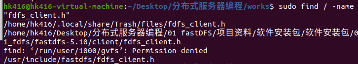

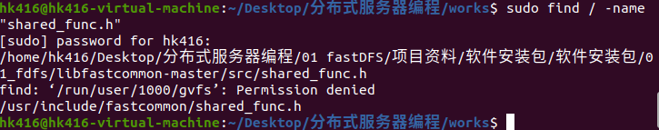

缺失库文件

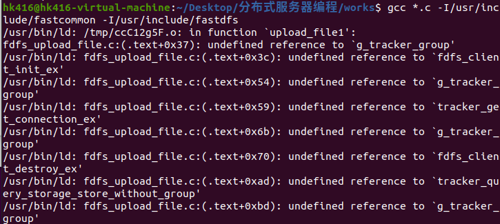


这个东西，左边是静态库，右边是动态库。

库的名字是  lib+xxx+.so，引用的时候加上参数 -lxxx  就行。

```
gcc *.c -I/usr/include/fastcommon -I/usr/include/fastdfs -lfdfsclient
```

生成了a.out文件，直接执行。

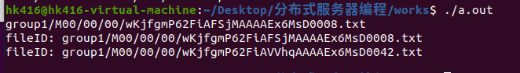

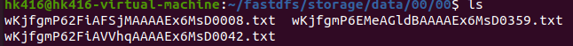

成功。

## 错误汇总

1.

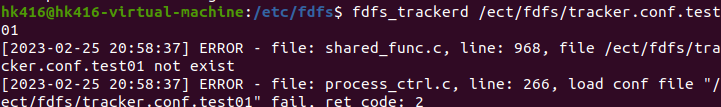

眼睛瞎了，etc不是ect。
