# redis安装

解压缩

```
tar -zxvf redis-4.0.8.tar.gz
```

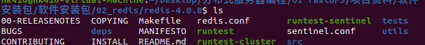

有makefile，直接make，然后make install

# 启动和关闭服务器

启动服务器

```
redis-server
redis-server confFilename(配置文件)
```

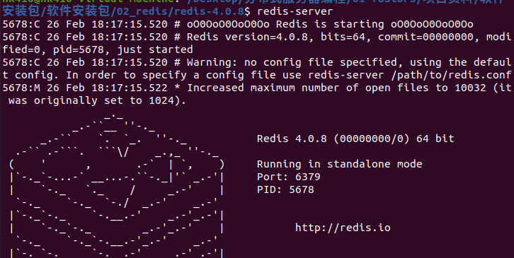

新开一个终端，

启动客户端

```
redis-cli    #默认连接本机回环地址，端口默认6379
redis-cli -p 端口     #连接本机指定端口服务器
redis-cli -h ip -p 端口     #连接远程服务器
```

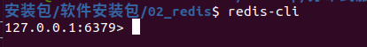

ping一下看看

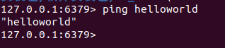

在客户端断开和服务器连接

```
shutdown
```

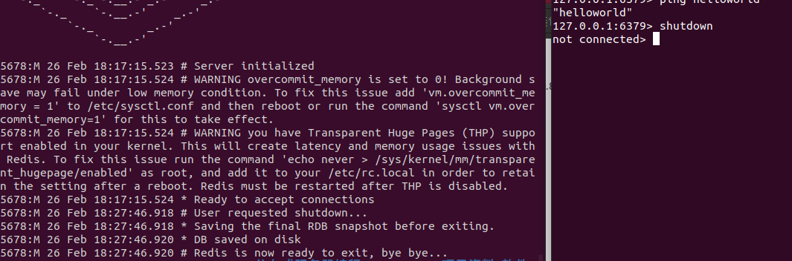

# redis基础知识

1. redis是什么？
   
   是非关系型数据库(内存数据库)。

2. 能干什么？
   
   访问存储频率高的数据。
   
   共享内存。

3. 怎么用？
   
   常用命令，常用数据类型。
   
   redis配置文件修改。
   
   redis数据持久化。
   
   redis接口(hiredis)。

## redis数据组织格式

键值对<key,value>

其中key一定是字符串

value可选，可以是下列数据结构：

    · string

    · list        

        · 存储多个string字符串

    · set

        · 与stl不同，数据是无序的

    · sortedset

        · 元素是键值对<score,member> 其中score必须是int或float

    · hash

        · 与set的区别：hash用数组实现，sortedset用红黑树。hash查找速度最快。

## redis常用命令

### ·  string

```
set key value                        #设置键值和数据映射关系
mset key1 value1 key2 value2 ...     #设置一个或多个键值对
get key                              #通过key获取value
mget key1 key2 ...
append key value                     #如果key存在，value追加到原value的末尾，否则等于set
                                     #返回总字符串长度
strlen key                           #返回value长度
decr key                             #将key中存储的value数字值减一，其中value必须是数字字符串
incr key                             #增加1
decrby key 非1值                      #减去非1值
incrby key 非1值
```

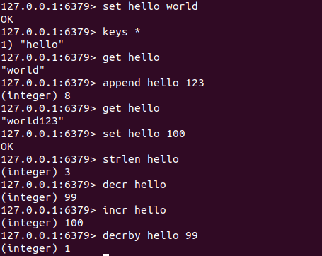

### · list

```
lpush key value [value]      #将新的value放到key表头，不存在则创建
lpushx key value [value]     #将新的value放到key表头,不创建新表
rpush key value [value]      #将新的value放到key表尾
lpop key
rpop key                     #对应的删除操作
lrange key start stop        #遍历,start和stop表示位置，
                             #start用正数，stop用负数，表示倒数第几个
lindex key index             #取第index个元素，从0开始
llen key                     #返回key对应字符串个数
lrem key count value         #根据count值，删除与value相同的元素
                             #count控制方向和个数，>0左起，=0删除全部
```


### · set

```
sadd key member [member]    #重复元素将被忽略
smembers key                #遍历集合
sdiff key01 [key02 ...]     #求差集key01-key02-...
sinter key [key...]         #求交集
sunion key [key...]         #求并集
srem key member [member]    #删除元素
spop key                    #删除并返回随机元素
```

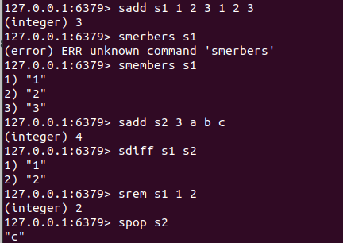

### · sortedset

```
zadd key score1 member1 [score2 member2 ...]    #score必须是int/float
zrange key start stop                           #类似list，按score递增
zrevrange key start stop                        #降序版本
zcount key min max                              #计算区间内元素个数(左开右闭)
zrank key member                                #返回该成员排名
zrevrank key member                             #降序版本
zrem key member [member...]                     #移除成员
zscore key member                               #返回对应分数
```

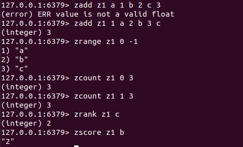

### · hash

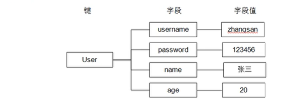

```
hset key field value                    #field即字段，类型无限制
hmset key field value [field value]
hget key field                          #获取对应值
hmget key field [field]   
hdel key field [field]                  #删除元素
hexists key field                       #返回bool
hgetall key
hincrby key field 值                    #同string
hkeys key                               #返回所有字段  
hvalues key                             #返回所有字段值   
hlen key
```

针对键值的相关命令

```
del key [key]
keys pattern                            #查找key，可用正则
exists key                              #key是否存在
expire key seconds                      #给key设置生存周期，超时自动删除
ttl key                                 #查看生存时间，-1表示永久
persist key                             #将key设置为永久
type key                                #返回key对应value的类型
```

# redis配置文件

复制一份配置文件到其他地方

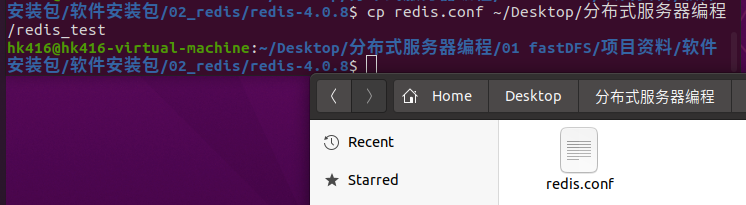

打开文件

找到69行bind

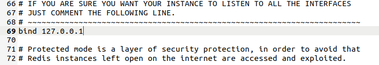

bind绑定谁，谁就能访问它。

绑定多个ip格式如下

```
bind 127.0.0.1 192.168.0.1 ...
```

如果想让所有客户端都能访问，注释掉该行即可。

第88行是保护模式选项，如果想允许远程访问，要关掉保护模式。

```
protected-mode no
```

92行是默认端口6379

136行 daemonize no 是否是守护进程。

158行 pidfile /var/run/redis_6379.pid 是守护进程就生成pid文件。

日志级别

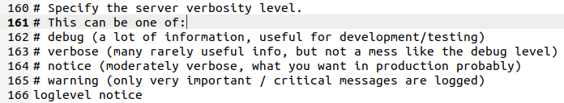

如果服务器是守护进程，写日志

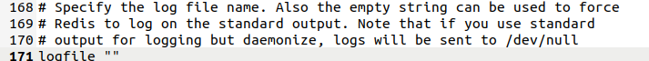

```
logfile ""    #这是没写
logfile ./redis.log    #指定日志文件才写
```

默认有16个数据库，默认用第0个，可用 select dbid 切换

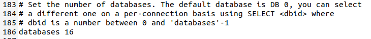

## 配置文件测试

做出如下修改：

关闭守护模式

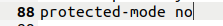

修改端口


开启守护进程，允许写日志和pid文件

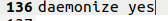

修改pid文件路径

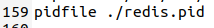

修改 日志路径


./表示当前路径

执行

```
redis-server redis.conf
```

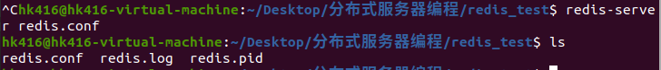

连接服务器

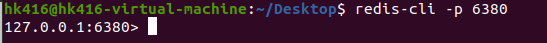

一些测试

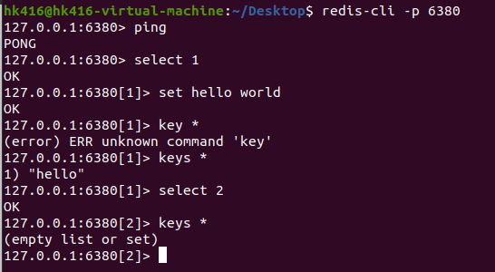

查看日志文件

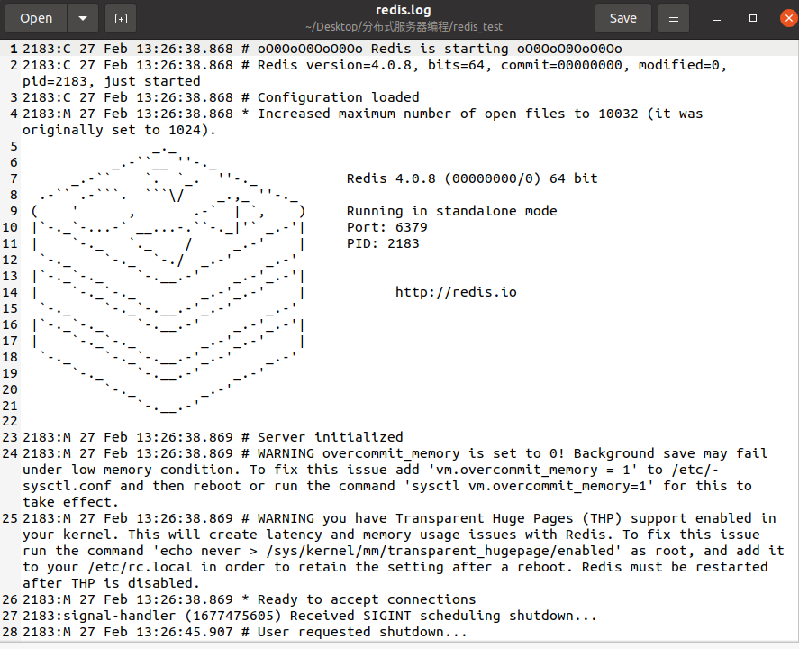

关闭客户端后发现dump.rdb

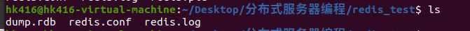

这是自动备份的持久化文件。

重启服务器和客户端，

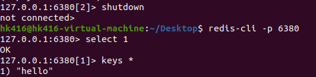

仍然能查到上次存入的数据。

# redis数据持久化

## 1.rdb方式

默认持久化方式。

磁盘的持久化文件后缀是.rdb。

将内存数据以二进制方式写入磁盘文件。

## 2.aof方式

默认关闭。

后缀.aof。

将生成数据的命令写入磁盘文件。

## 比较

1. 存储容量
   
   rdb文件较小，恢复时间短，效率高。
   
   aof文件较大，恢复时间长，效率低。

2. 同步频率
   
   rdb同步频率低，数据完整性低，容易丢失数据。
   
   aof同步频率高，数据完整性高。

## 持久化设置

rdb频率

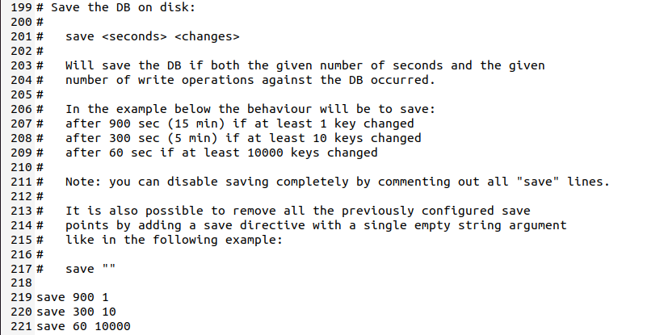

save 900 1含义：在900秒内发生1次变化，存储一次。

如果有多条，任意一个满足都触发。

aof设置，默认关闭


aof更新频率

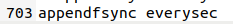

## 一些问题

1. rdb和aof能否同时打开？
   
   可以。

2. 能不能同时关闭？
   
   可以。
   
   如何关闭rdb?
   
   将频率改为  save ""

3. 如果都开启，恢复数据选哪种？
   
   都可以。
   
   效率出发，选rdb，数据完整性出发，选aof。

# hiredis

解压，安装(过程略)。

连接服务器

```c
redisContext *redisConnect(const char *ip, int port);
redisContext *redisConnectWithTimeout(const char *ip, int port, const struct timeval tv);
```

执行命令

```c
void *redisCommand(redisContext *c, const char *format, ...);
```

返回值是void* 类型，但是接受的reply是redisReply类型的结构体指针。

```c
/* This is the reply object returned by redisCommand() */
typedef struct redisReply { 
    int type; /* REDIS_REPLY_* */
    long long integer; /* The integer when type is REDIS_REPLY_INTEGER */
    size_t len; /* Length of string */
    char *str; /* Used for both REDIS_REPLY_ERROR and REDIS_REPLY_STRING */
    size_t elements; /* number of elements, for REDIS_REPLY_ARRAY */
    struct redisReply **element; /* elements vector for REDIS_REPLY_ARRAY */
} redisReply;
```

释放资源

```c
void freeReplyObject(void *reply);
void redisFree(redisContext *c);
```

```c
/* Context for a connection to Redis */
typedef struct redisContext {
    int err; /* Error flags, 0 when there is no error */
    char errstr[128]; /* String representation of error when applicable */
    int fd;
    int flags;
    char *obuf; /* Write buffer */
    redisReader *reader; /* Protocol reader */

    enum redisConnectionType connection_type;
    struct timeval *timeout;

    struct {
        char *host;
        char *source_addr;
        int port;
    } tcp;

    struct {
        char *path;
    } unix_sock;

} redisContext;
```

一个简单用例：

```c
#include<stdio.h>
#include<hiredis.h>

int main(){
    redisContext *c = redisConnect("127.0.0.1",6379);
    if(c->err!=0){    
        return -1;
    }

    void *ptr = redisCommand(c,"hmset usr usrname z3 age 24");
//    redisCommand(c,"hmset usr usrname z3 age 24 %s %s",str1,str2);
    redisReply *reply = (redisReply*)ptr;    //type transfer
    if(reply->type == 2){
        printf("state:%s",reply->str);
    }

    freeReplyObject(reply);

    ptr = redisCommand(c,"hgetall usr");
    reply = (redisReply*)ptr;
    if(reply->type == 2){
        for(int i = 0;i < reply->elements;i+=2){
            printf("key:%s  value:%s\n",reply->element[i]->str,reply->element[i]->str);
        }
    }

    freeReplyObject(reply);
    redisFree(c);
    return 0;
}
```

编译

记录一下过程。

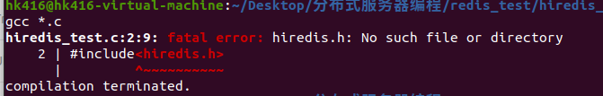

找头文件

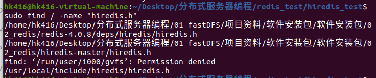

用最后一个

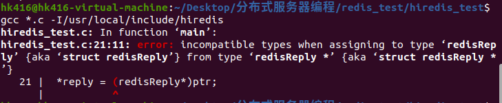

删掉*

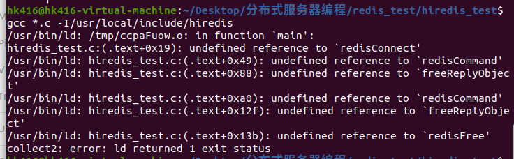

缺失库


行了。

开启服务器，启动客户端，执行a.out文件。

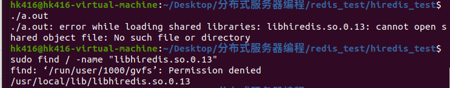

报错了，找到缺失库位置，去/etc/ld.so.conf 里加上这个地址。

执行下列命令：

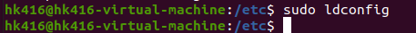

再执行

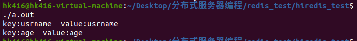

成功。


成功写入。
