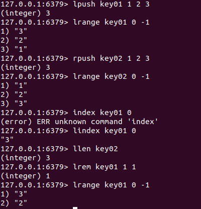

# redis安装

解压缩

```
tar -zxvf redis-4.0.8.tar.gz
```


有makefile，直接make，然后make install


# 启动和关闭服务器

启动服务器

```
redis-server
redis-server confFilename(配置文件)
```


新开一个终端，

启动客户端

```
redis-cli    #默认连接本机回环地址，端口默认6379
redis-cli -p 端口     #连接本机指定端口服务器
redis-cli -h ip -p 端口     #连接远程服务器
```


ping一下看看


在客户端断开和服务器连接

```
shutdown
```


# redis基础知识

## redis数据组织格式

键值对<key,value>

其中key一定是字符串

value可选，可以是下列数据结构：

    · string

    · list        

        · 存储多个string字符串

    · set

        · 与stl不同，数据是无序的

    · sortedset

        · 元素是键值对<score,member> 其中score必须是int或float

    · hash

        · 与set的区别：hash用数组实现，sortedset用红黑树。hash查找速度最快。


## redis常用命令

### ·  string

```
set key value                        #设置键值和数据映射关系
mset key1 value1 key2 value2 ...     #设置一个或多个键值对
get key                              #通过key获取value
mget key1 key2 ...
append key value                     #如果key存在，value追加到原value的末尾，否则等于set
                                     #返回总字符串长度
strlen key                           #返回value长度
decr key                             #将key中存储的value数字值减一，其中value必须是数字字符串
incr key                             #增加1
decrby key 非1值                      #减去非1值
incrby key 非1值
```


### · list

```
lpush key value [value]      #将新的value放到key表头，不存在则创建
lpushx key value [value]     #将新的value放到key表头,不创建新表
rpush key value [value]      #将新的value放到key表尾
lpop key
rpop key                     #对应的删除操作
lrange key start stop        #遍历,start和stop表示位置，
                             #start用正数，stop用负数，表示倒数第几个
lindex key index             #取第index个元素，从0开始
llen key                     #返回key对应字符串个数
lrem key count value         #根据count值，删除与value相同的元素
                             #count控制方向和个数，>0左起，=0删除全部
```



### · set

```
sadd key member [member]    #重复元素将被忽略
smembers key                #遍历集合
sdiff key01 [key02 ...]     #求差集key01-key02-...
sinter key [key...]         #求交集
sunion key [key...]         #求并集
srem key member [member]    #删除元素
spop key                    #删除并返回随机元素
```


### · sortedset

```
zadd key score1 member1 [score2 member2 ...]    #score必须是int/float
zrange key start stop                           #类似list，按score递增
zrevrange key start stop                        #降序版本
zcount key min max                              #计算区间内元素个数(左开右闭)
zrank key member                                #返回该成员排名
zrevrank key member                             #降序版本
zrem key member [member...]                     #移除成员
zscore key member                               #返回对应分数
```


### · hash


```
hset key field value                    #field即字段，类型无限制
hmset key field value [field value]
hget key field                          #获取对应值
hmget key field [field]   
hdel key field [field]                  #删除元素
hexists key field                       #返回bool
hgetall key
hincrby key field 值                    #同string
hkeys key                               #返回所有字段  
hvalues key                             #返回所有字段值   
hlen key
```

针对键值的相关命令

```
del key [key]
keys pattern                            #查找key，可用正则
exists key                              #key是否存在
expire key seconds                      #给key设置生存周期，超时自动删除
ttl key                                 #查看生存时间，-1表示永久
persist key                             #将key设置为永久
type key                                #返回key对应value的类型
```


# redis配置文件

复制一份配置文件到其他地方


打开文件

找到69行bind


bind绑定谁，谁就能访问它。

绑定多个ip格式如下

```
bind 127.0.0.1 192.168.0.1 ...
```

如果想让所有客户端都能访问，注释掉该行即可。

第88行是保护模式选项，如果想允许远程访问，要关掉保护模式。

```
protected-mode no
```

92行是默认端口6379

136行 daemonize no 是否是守护进程。

158行 pidfile /var/run/redis_6379.pid 是守护进程就生成pid文件。


日志级别


如果服务器是守护进程，写日志


```
logfile ""    #这是没写
logfile ./redis.log    #指定日志文件才写
```

默认有16个数据库，默认用第0个，可用 select dbid 切换


