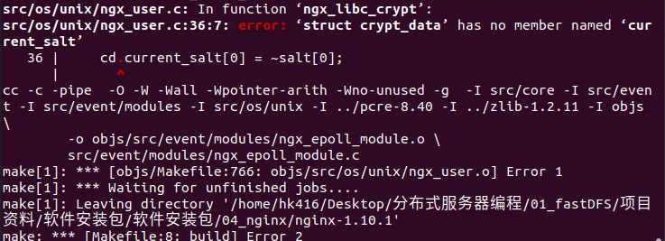
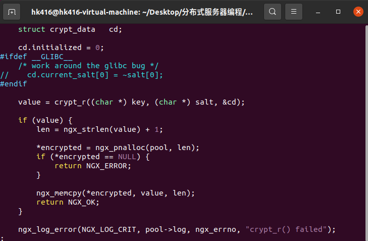

# nginx是什么

1. 作为web服务器，解析http协议。

2. 作为反向代理服务器。

3. 作为邮件服务器。

# nginx优点

1. 快速。

2. 高扩展性。

3. 高可靠性。

4. 低内存消耗。

5. 支持大量并发。

6. 热部署。

7. 高自由BSD许可协议。

# 一些基础知识

1. 正向代理与反向代理。
   
   正向代理，意思是一个位于客户端和原始服务器之间的服务器，为了从原始服务器取得内容，客户端向代理发送一个请求并指定目标(原始服务器)，然后代理向原始服务器转交请求并将获得的内容返回给客户端。客户端才能使用正向代理。
   
   典型如vpn。
   
   反向代理服务器位于用户与目标服务器之间，但是对于用户而言，反向代理服务器就相当于目标服务器，即用户直接访问反向代理服务器就可以获得目标服务器的资源。同时，用户不需要知道目标服务器的地址，也无须在用户端作任何设定。反向代理服务器通常可用来作为Web加速，即使用反向代理作为Web服务器的前置机来降低网络和服务器的负载，提高访问效率。

2. 反向代理分配资源
   
   反向代理服务器将客户端请求转发给N台web服务器；反向代理服务器以轮询方式转发。

3. url
   
   统一资源定位符。
   
   格式：协议://ip地址/路径和文件名

4. DNS协议
   
   
   
   服务器从底到顶：本地，根，顶级，权限。
   
   递归查询：dfs
   
   迭代查询：bfs
   
   
   
   域名缓存
   
   计算机中 DNS 记录在本地有两种缓存方式：浏览器缓存和操作系统缓存。
   
   **浏览器缓存**：浏览器在获取网站域名的实际 IP 地址后会对其进行缓存，减少网络请求的损耗。每种浏览器都有一个固定的 DNS 缓存时间，如 Chrome 的过期时间是 1 分钟，在这个期限内不会重新请求 DNS。
   
   **操作系统缓存**：操作系统的缓存其实是用户自己配置的 hosts 文件。比如 Windows10 下的 hosts 文件存放在 C:\Windows\System32\drivers\etc\hosts
   
   在浏览器中进行访问的时候，会优先查询浏览器缓存，如果未命中则继续查询操作系统缓存，最后再查询本地域名服务器，然后本地域名服务器会递归的查找域名记录，最后返回结果。**主机和本地域名服务器之间的查询方式是递归查询**，也就是说主机请求本地域名服务器，那么本地域名服务器作为请求的接收者一定要给主机想要的答案。
   
   域名解析完整过程：
   
   1. 搜索浏览器DNS缓存。
   
   2. 搜索操作系统DNS缓存。
   
   3. 向本地域名服务器进行递归查询。
   
   4. 本地域名服务器向上级域名服务器进行迭代查询。
   
   5. 本地域名服务器返回查询结果，同时缓存。
   
   6. 操作系统将结果传给浏览器，同时缓存。
   
   7. 浏览器获得ip地址，同时缓存。

5. http协议
   
   1. 请求消息
      
      请求行，请求头，空行，数据正文。
      
      get方式和post方式区别：
      
      在规范中，定义 GET 请求是用来获取资源的，也就是进行查询操作的，而 POST 请求是用来传输实体对象的，因此会使用 POST 来进行添加、修改和删除等操作。
      
      1. GET 请求一般会被缓存，比如常见的 CSS、JS、HTML 请求等都会被缓存；而 POST 请求默认是不进行缓存的。
      
      2. GET 请求的参数是通过 URL 传递的；而 POST 请求参数是存放在请求正文（request body）中的，没有大小限制。
      
      3. GET 请求可以直接进行回退和刷新，不会对用户和程序产生任何影响；而 POST 请求如果直接回滚和刷新将会把数据再次提交.
      
      4. GET 请求的参数会保存在历史记录中，而 POST 请求的参数不会保留到历史记录中。
   
   2. 响应消息
      
      状态行，消息报头，空行，响应正文。

6. 动态url
   
   在URL中出现类似于“?”这样的参数符号，并且后缀为ASPX、ASP、JSP、PHP、Perl和CGI的URL。
   
   优点：
   
   1. 同一类型的网页使用相同的URL类型，便于管理。
   
   2. 动态URL中的参数可以提示搜索引擎，有利于网页的关键词排名。
   
   3. 网站的物理结构是扁平的。网页由同一网页调用，网页最多有两级目录结构，便于管理，提高处理速度。
   
   缺点：
   
   1. 动态URL相对难以传播。
   
   2. 动态URL中的参数可能会使搜索引擎蜘蛛陷入一个无限的爬行周期，造成搜索引擎和服务器资源的巨大浪费。
   
   3. 如果动态URL中的参数按顺序更改，或者网页具有访问会话ID，则这些相同的页面将被视为不同的页面。它会使搜索引擎认为网站上有很多重复的内容。
   
   与静态url对比：
   
   1. 动态URL较之静态的URL不利于搜索引擎抓取。
   
   2. 动态网址的生成是采集数据库的内容，不易被搜索引擎抓取快照。
   
   3. 在建设反向链接过程中，动态URL具有非永久性。
   
   4. 静态URL打开速度更快，有利于提高用户体验性。

# nginx安装

1. 前置安装库
   
   openssl 
   
   ```
   ./config
   
   make
   
   sudo make install
   ```
   
   Zlib
   
   ```
   ./configure
   
   make
   
   sudo make install
   ```
   
   PCRE

```
./configure

make

sudo make install
```

   注意，bz2解压参数为 -jxvf

2. 安装nginx
   
   ```
   #选低版本是为了配合fastdfs插件
   tar -zxvf nginx-1.10.1.tar.gz
   # 如果是个人学习
   ./configure
   # 配合其它部署，要链接库，库要根据源码安装包的位置自己找
   ./configure --with-openssl=../nginx-1.10.1 --with-pcre=../pcre-8.40 --with-zlib=../zlib-1.2.11
   make
   sudo make install
   ```
   
   缺失库sha1
   
   
   
   这个问题可以不用管，ubuntu现在不用sha1校验了。
   
   
   
   警告被当做错误处理了，去objs/Makefile看看
   
   
   
   Werror，表示将警告作为错误处理，去掉这个参数。
   
   另一个错误：
   
   
   
   注释掉错误行
   
   
   
   再次make就能成功。

# nginx测试

1. nginx安装目录
   
   /usr/local/nginx
   
   
   
   conf是配置文件
   
   html是网页静态资源
   
   logs是日志
   
   sbin启动nginx的可执行程序

2. nginx可执行程序路径
   
   /usr/local/nginx/sbin/nginx
   
   为了快速启动，有两种方式
   
   1. 将/usr/local/nginx/sbin加入环境变量path。
      
      ```
      #仅对当前用户，临时有效
      export PATH=/usr/local/nginx/sbin:$PATH
      #仅对当前用户，永久有效
      sudo vim ~/.bashrc
      #在最后一行加上 export PATH=/usr/local/nginx/sbin:$PATH
      source ~/.bashrc
      ```
   
   2. 创建软连接，放到path下某个路径。
      
      
      
      ```
      #永久有效
      ln -s /usr/local/nginx/sbin/nginx /usr/bin/nginx
      ```

3. 启动nginx
   
   
   
   ```
   sudo nginx
   ```

4. 关闭nginx
   
   ```
   #立即关闭
   sudo nginx -s stop
   #本次操作结束后关闭
   sudo nginx -s quit
   ```
   
   

5. 重新加载nginx
   
   ```
   sudo nginx -s reload
   ```
   
   在修改配置文件后需要执行该命令。

6. 测试
   
   打开nginx，在主机访问虚拟机ip地址。
   
   

# nginx配置文件


修改nginx.conf即可。

## 配置文件组织格式


1. http模块：处理http通信设置
   
   1. server模块：每个server对应一个web服务器。
      
      1. location模块：处理客户端不同请求。

2. main模块：处理邮件设置。

## 常用配置项

```
#启动后的worker进程归属，nobody是普通用户，可改为root以获取更多权限
user  nobody;    
#worker进程个数
worker_processes  1; 
#日志的位置，在/usr/local/nginx下
error_log  logs/error.log <notice/info>;    
#pid文件位置
pid        logs/nginx.pid;
#事件处理
events {
    use epoll;//多路io转接模型
    worker_connections  1024;
}
#http模块
http {
    include       mime.types;
    default_type  application/octet-stream;

    #log_format  main  '$remote_addr - $remote_user [$time_local] "$request" '
    #                  '$status $body_bytes_sent "$http_referer" '
    #                  '"$http_user_agent" "$http_x_forwarded_for"';

    #access_log  logs/access.log  main;

    sendfile        on;
    #tcp_nopush     on;

    #keepalive_timeout  0;
    keepalive_timeout  65;

    #gzip  on;

    server {
        listen       80;//监听端口，80是http默认端口，https是443
        server_name  localhost;//域名

        #charset koi8-r;//字符编码，中文一般utf8

        #access_log  logs/host.access.log  main;//服务器日志

        location / {
            root   html;
            index  index.html index.htm;
        }

        #error_page  404              /404.html;

        # redirect server error pages to the static page /50x.html
        #
        error_page   500 502 503 504  /50x.html;
        location = /50x.html {
            root   html;
        }
    }  
}
```

## 服务器如何处理客户端请求

```
http://192.168.1.1:80/local/local.html
```

1. 去掉协议

2. 去掉ip/域名+端口

3. 去掉最后的文件名

4. 剩下/local
   
   location处理的指令就是 /local
   
   /代表服务器资源根目录

## 部署静态网页


将yundisk复制到/usr/local/nginx，和html文件夹同级。

声明yundisk为资源文件夹

```shell
location / {
    root yundisk;
    #如果请求是一个目录，需要默认显示网页
    index index.html index.htm;
}
#配置完成后重启
```


测试1：

```
http://192.168.223.130:80/index.html
```


看看nginx运行状态


worker进程权限有问题


改成root用户

重启


可以访问了。

测试2：

```
http://192.168.223.130:80/hello/reg.html

修改
location /hello/ {
    root yundisk;
}
```


创建对应路径，放入对应文件，由于网页要用到一些图片，把static文件夹也拷贝过去。


访问网站


# 反向代理

1. 客户端：windows中的浏览器。

2. 反向代理服务器：windows

3. web服务器：ubuntu虚拟机，ip 192.168.223.130

反向代理设置：

在windows下安装nginx，打开nginx.conf

```
user  root;
worker_processes  1;

#error_log  logs/error.log;
#error_log  logs/error.log  notice;
#error_log  logs/error.log  info;

#pid        logs/nginx.pid;

events {
    worker_connections  1024;
}

http {
    include       mime.types;
    default_type  application/octet-stream;

    #log_format  main  '$remote_addr - $remote_user [$time_local] "$request" '
    #                  '$status $body_bytes_sent "$http_referer" '
    #                  '"$http_user_agent" "$http_x_forwarded_for"';

    #access_log  logs/access.log  main;

    sendfile        on;
    #tcp_nopush     on;

    #keepalive_timeout  0;
    keepalive_timeout  65;

    #gzip  on;
    #有几个web服务器，就配置几个server
    server {
        listen       80;    #客户端访问反向代理服务器，代理服务器监听的端口
        server_name  ubuntu.test.com;    #反向代理服务器需要的域名
        #假设访问 http://192.168.1.1/local.html
        #反向代理服务器不处理它，而是转发它
        location / {
            proxy_pass http://hk416.com;    #转发到http://自定义
        }

        error_page   500 502 503 504  /50x.html;
        location = /50x.html {
            root   html;
        }
    }
    #与server平级的代理模块
    upstream hk416.com{    #上面自定义的名字
        server 192.168.223.130:80;
        #代理服务器的ip
    }
}
上面自定义的名字
        server 192.168.223.130:80;
        #代理服务器的ip
    }
}
```

修改host文件：


访问ubuntu.test.com,成功访问了虚拟机的nginx服务器。


有条件的可以开多个虚拟机测试。

# 在反向代理的基础上进行负载均衡设置

如果不用负载均衡，那么每个web服务器都要配置一个server模块。

```
user  root;
worker_processes  1;

#error_log  logs/error.log;
#error_log  logs/error.log  notice;
#error_log  logs/error.log  info;

#pid        logs/nginx.pid;

events {
    worker_connections  1024;
}

http {
    include       mime.types;
    default_type  application/octet-stream;

    #log_format  main  '$remote_addr - $remote_user [$time_local] "$request" '
    #                  '$status $body_bytes_sent "$http_referer" '
    #                  '"$http_user_agent" "$http_x_forwarded_for"';

    #access_log  logs/access.log  main;

    sendfile        on;
    #tcp_nopush     on;

    #keepalive_timeout  0;
    keepalive_timeout  65;

    #gzip  on;
    #有几个web服务器，就配置几个server
    server {
        listen       80;    #客户端访问反向代理服务器，代理服务器监听的端口
        server_name  localhost;    #反向代理服务器需要的域名
        #假设访问 http://192.168.1.1/local.html
        #反向代理服务器不处理它，而是转发它
        location / {
            proxy_pass http://hk416.com;    #转发到http://自定义
        }

        error_page   500 502 503 504  /50x.html;
        location = /50x.html {
            root   html;
        }
    }
    #与server平级的代理模块
    upstream hk416.com{    #上面自定义的名字
        server 192.168.223.130:80;
        #代理服务器的ip
        #可以添加多个ip，进行负载均衡(轮询)  
        #server 192.168.xxx.xxx:80;
    }
}
```

注意：有时候关闭了服务器，缺仍能访问nginx页面，是因为有缓存。

同时，windows下尽量用`start .\nginx.exe`

缓存不会关就重启。

# 总结

1. nginx是什么？
   
   是一个开源框架，包含库（一套api）和一个事件处理机制。

2. nginx能做什么？
   
   web服务器，反向代理服务器，邮件服务器。

3. 怎么实现？
   
   添加location指令解析请求。
