# fastcgi介绍

1. cgi
   
   通用网关接口，描述了客户端和服务器传输数据的一种标准。
   
   
   
   cgi接受nginx转发的请求，连接数据，查询数据库，返回结果。

2. cgi工作流程
   
   1. 用户通过浏览器访问服务器，发送请求。
   
   2. 服务器接收数据，进行解析。
   
   3. nginx对于一些数据不知道如何处理，转发给cgi程序。服务器创建一个cgi进程。
   
   4. cgi执行，加载配置，连接其它服务器，得到结果，返回给服务器，退出。
   
   5. 服务器将cgi处理结果返回给用户。

3. cig优缺点：
   
   每次都要重新启动进程，效率低。安全性低。

4. fastcgi与cgi区别
   
   fastcgi是一个常驻的cgi，生命周期长，不用频繁重启，效率高。

5. fastcgi工作流程
   
   与cgi工作流程相比，通过fastcgi进程管理器启动，这个管理器和web服务器在同一台主机上。fastcgi通过本地套接字或者网络通信与web服务器通信。
   
   fastcgi启动后处于循环状态，有请求则处理，没有请求则阻塞。

# fastcgi安装

先安装spawn-fcgi，这是fastcgi的进程管理器。

自己装。

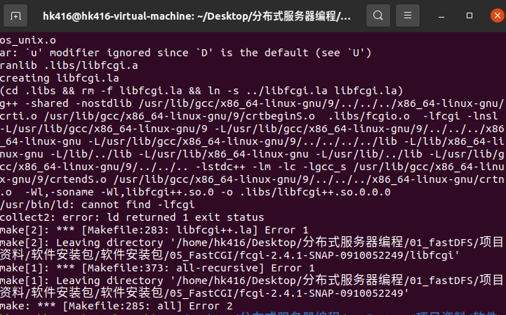

fastcgi在make的时候报错

没有包含头文件 stdio.h 


打开这个文件，加上头文件即可。

# nginx+fastcgi

nginx扮演web服务器角色

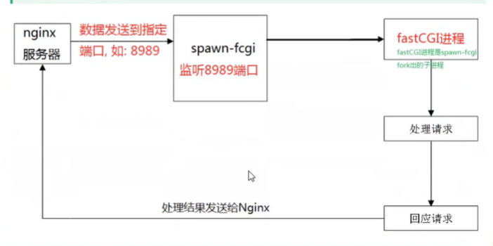

修改nginx配置文件：

对于动态url，去掉?后面的字符串，其它与静态url相同。

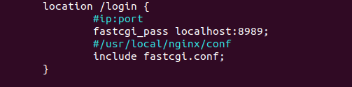

```
fastcgi_pass ip:port;    #转发到
include fastcgi.conf;    #包含配置文件
```

启动spawn-fcgi

```
spawn-fcgi -a ip -p port -f ./执行程序
#ip和port要与nginx中配置的相同，注意localhost对应127.0.0.1
```

fastcgi程序编写

可以参考echo.c

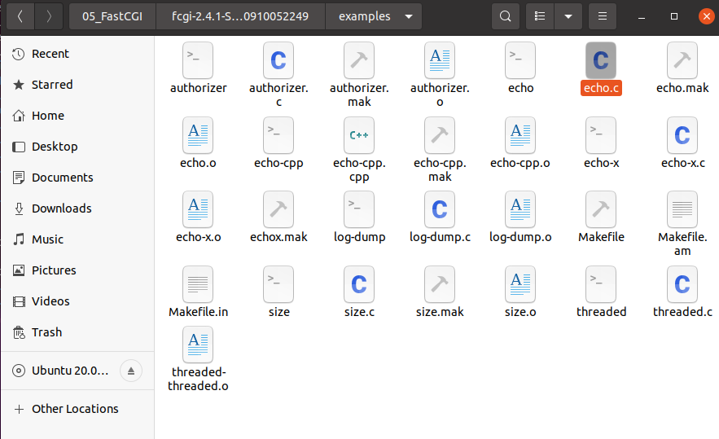

程序基本思路

```c
#include <stdio.h>
#include <stdlib.h>
#include <unisted.h>
#include <process.h>
#include "fcgi_stdio.h"
#include "fcgi_config.h"
//如果编译时找不到，指定-I参数
//常用头文件
int main(){
    //循环框架必须有,FCGI_Accept是阻塞函数，nginx发送数据才解除阻塞
    int count = 0;
    while (FCGI_Accept() >= 0){
        //首先接收数据
        //post方式
        char *contentLength = getenv("CONTENT_LENGTH");
        //根据长度大小判断是否需要循环接收
        //get方式
        char *text = getenv("QUERY_STRING");
        //按照业务流程处理
        //自己写

        //将结果发送给nginx
        //声明返回结果的格式，即Content-type
        printf("Content-type: text/html\r\n"
        "\r\n"
        "<title>FastCGI echo</title>"
        "<h1>FastCGI echo</h1>\n"
            "Request number %d,  Process ID: %d<p>\n", ++count, getpid());

    }


}
```

示例测试，测试程序用echo.c

把zyFile文件复制到/usr/local/nginx下，


修改配置文件。

访问

```
http://192.168.223.130/demo.html
```


成功。随便选个照片上传。


失败原因：只能显示静态网页，没有做动态网页的配置。

打开demo.html文件，看看源码对上传操作是怎么定义的，

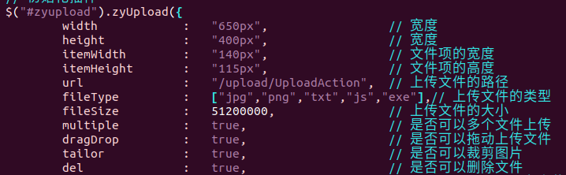

再去看看error.log

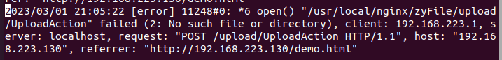

错误原因是没有对upload/UploadAction 的解析。

修改配置文件：


端口自己选个空闲的。

重启nginx。


错误原因：没有fastcgi程序处理这个转发。

拷贝一份demo.c程序到自己的路径下，编译。

回忆一下怎么解决缺失头文件和库。

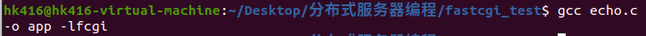

查看动态库

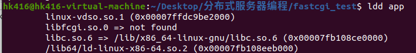

发现缺失libfcgi.so

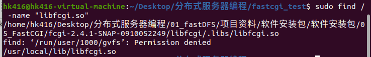

将路径加入环境变量

```shell
vim /etc/ld.so.conf
sudo ldconfig
```

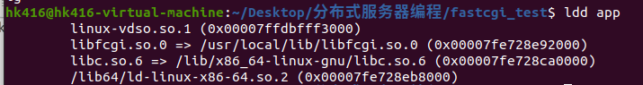

可以看到成功链接了。

```shell
spawn-fcgi -a 127.0.0.1 -p 9999 -f ./app
```

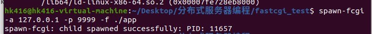

成功启动。

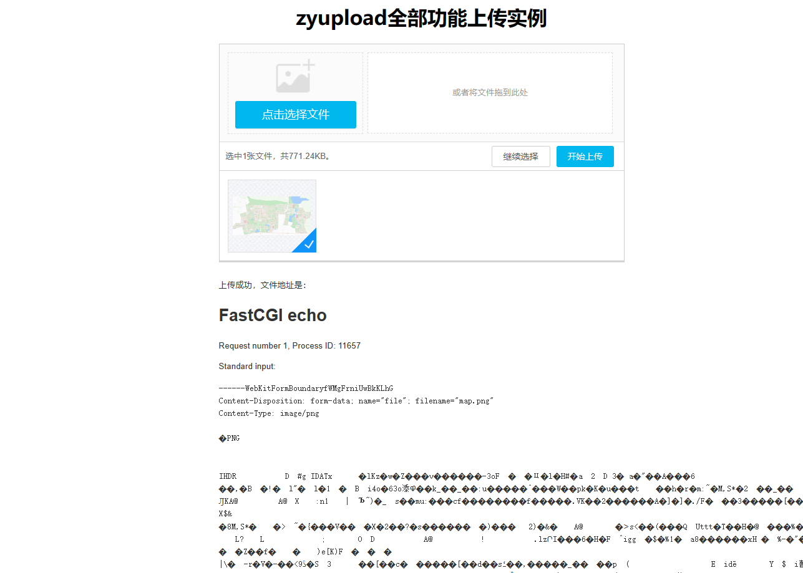

fastcgi把接受的内容原封不动地发回了nginx。

# 常用环境变量

在上面的fcgi程序中，我们用到了一些环境变量

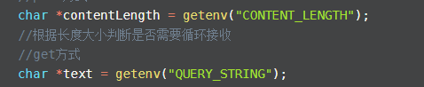

这些常用的环境变量需要了解：

```
QUERY_STRING    请求的参数，即请求行第二部分
REQUEST_METHOD    请求的动作 GET/POST
CONTENT_TYPE    请求报文第四部分，即正文的数据格式 jpg/txt......
CONTENT_LENGTH    正文长度
```

# 总结

1. fastcgi是什么？
   
   是快速通用网络接口。

2. 是干什么的？
   
   帮助用户处理客户端请求。

3. 怎么用？
   
   nginx转发数据：修改nginx.conf，在location模块利用fastcgi_pass指定转发ip和端口。
   
   fastcgi接受数据：启动spawn-fcgi，指定正确的ip和端口，启动编译好的fastcgi程序。在程序中，调用读/写终端函数，来接受和发送数据。
   
   fastcgi处理数据：利用环境变量获取信息，处理数据，回发数据用printf，数据会被重定向到nginx服务器。

# 服务器文件上传/下载流程

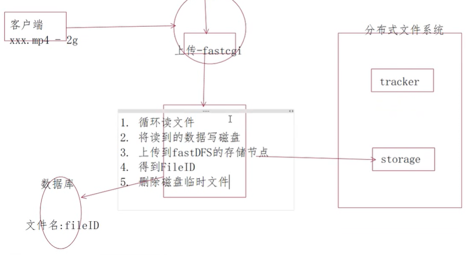

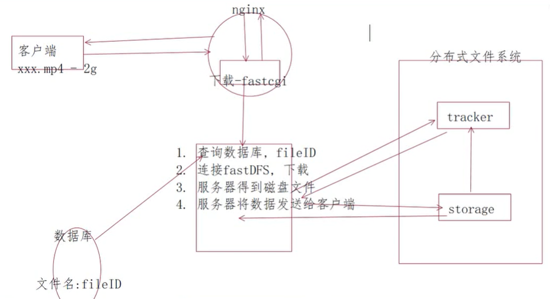
