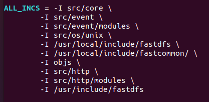
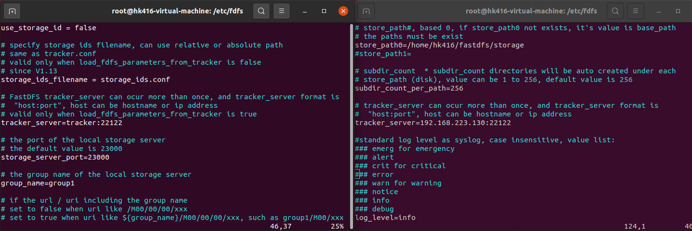
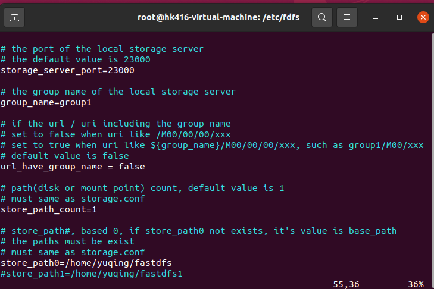
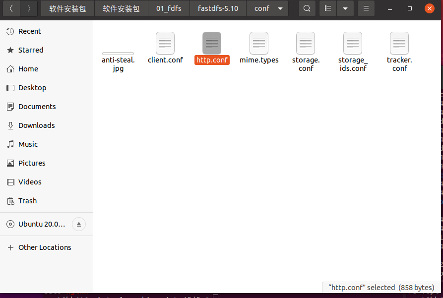
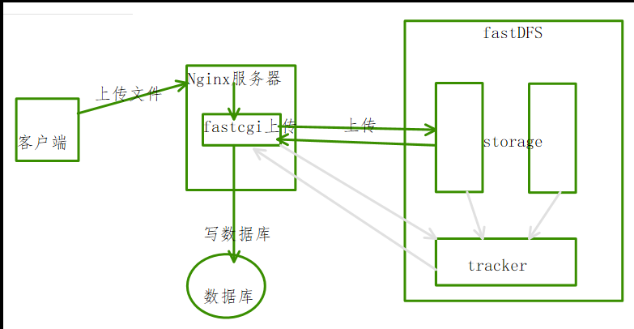

# 为什么要使用fastdfs+nginx插件

nginx只能解析http请求

fastdfs各结点间用tcp通信

安装该插件是为了实现fastdfs与nginx通信。

# 插件安装

1. 在fastdfs存储节点上安装nginx以及插件
   
   解压插件压缩包
   
   ```shell
   tar -zxvf fastdfs-nginx-module_v1.16.tar.gz
   ```
   
   解压后有src文件夹，记住该文件夹路径。
   
   进入nginx源码安装目录：
   
   ```shell
   ./configure --add-module=/home/hk416/Desktop/分布式服务器编程/01_fastDFS/项目资料/软件安装包/软件安装包/06_fastdfs_nginx_module/fastdfs-nginx-module/src
   ```
   
   
   
   然后
   
   ```shell
   make -j4
   ```
   
   
   
   报错，缺失头文件
   
   ```shell
   sudo su    #进入root模式查找
   find / -name "fdfs_define.h"
   ```
   
   
   
   修改objs/Makefile文件
   
   
   
   这就是包含头文件的目录，加上
   
   ```shell
   -I /usr/include/fastdfs
   ```
   
   
   
   后面还会有类似错误，干脆一次性解决。
   
   ```shell
   -I /usr/include/fastcommon
   ```
   
   
   
   老毛病了
   
   去objs/Makefile 删掉一个参数
   
   
   
   然后
   
   ```shell
   make -j4
   make install
   ```
   
   
   
   此时新nginx已经安装，旧的被命名为old。
   
   打开nginx测试
   
   
   
   发现没有worker进程，查看error.log
   
   
   
   错误：缺失配置文件，我们去对应路径看看
   
   
   
   从插件安装包找到配置文件，放到该路径
   
   
   
   修改该配置文件，参考存储节点的配置文件storage.conf
   
   
   
   将base_path改为和存储节点一致
   
   
   
   修改tracker_server和port，以及组名
   
   
   
   url_have_group_name一般改为true（用户请求下载时，url会包含组名）
   
   
   
   store_path和count要一致。
   
   需要修改的项大致如上。
   
   
   
   还是没有worker，再看看日志。
   
   
   
   缺失头文件，去fastdfs源码安装目录去找
   
   
   
   
   
   重启，又报错
   
   
   
   熟悉的问题，去nginx源码安装目录找，
   
   
   
   这个东西复制到/etc/fdfs
   
   
   
   重启
   
   ```shell
   # 测试
   ps -ef|grep nginx
   ```
   
   

# 文件下载测试

```shell
fdfs_trackerd /etc/fdfs/tracker.conf
fdfs_storaged /etc/fdfs/storage.conf
fdfs_upload_file /etc/fdfs/client.conf test.txt
```


在浏览器访问改文件

```shell
http://192.168.223.130:80/group1/M00/00/00/wKjfgmQEX2eAIViPAAAAEx6MsD0470.txt
```


查看错误日志

```shell
2023/03/05 17:26:41 [error] 2426#0: *6 open() "/usr/local/nginx/zyFile/group1/M00/00/00/wKjfgmQEX2eAIViPAAAAEx6MsD0470.txt" failed (2: No such file or directory), client: 192.168.223.1, server: localhost, request: "GET /group1/M00/00/00/wKjfgmQEX2eAIViPAAAAEx6MsD0470.txt HTTP/1.1", host: "192.168.223.130"
```

没有这个文件或目录，查看请求行，显然上传的文件不在这个文件夹里，需要给服务器指定文件位置，文件在存储节点的存储目录stroage_path0中，修改服务器端配置文件，加一个location


data就是M00的映射路径

```shell
location /group1/M00/ {
    #指定映射路径
    root /home/hk416/fastdfs/storage/data;
    ngx_fastdfs_module;
}
```

由于/group1/M00/00/00是多变的，把M00后面的去掉。

也可用正则表达式。

重启nginx，


成功。

实际上下载到本地缓存了。

ctrl+s即可保存到本地。

# 文件上传/下载流程

## 上传

1. 客户端向nginx服务器(web服务器)提出请求。

2. nginx调用同一台主机上的fastcgi，与数据库建立连接。

3. fastdfs的存储节点向追踪器发起连接。

4. fastcgi(客户端)向追踪器发起请求，追踪器返回存储节点的地址信息。

5. 随后fastcgi(客户端)向存储节点发起连接，存储节点返回fileID。

6. fastcgi将存储信息写入数据库。
   
   

## 快速下载

1. 客户端直接连接fastDFS存储节点，在存储节点主机上安装nginx+fastdfs插件，由nginx解析url，转发给同一台主机上的fastdfs，从而实现快速下载。

2. 在文件上传时，将fileID和存储节点的ip都进行存储，从而知道文件和存储节点的对应关系(配置location)。
   
   
