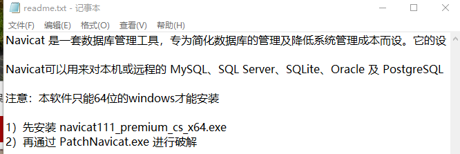

# Windows安装mysql

[(61条消息) Windows安装mysql详细步骤（通俗易懂，简单上手）_华夏之威的博客-CSDN博客](https://blog.csdn.net/weixin_43423484/article/details/124408565)

提前避坑：用管理员模式cmd

```shell
#进入d盘
d:
#进入指定路径
cd <path>
```


安装成功截图。

密码复制下来备用。

```
ogusMo#-a0,:
```


安装成功。


修改一下密码。

安装可视化工具：



安装X64的，猛闪退，也不知道咋回事。

卸载了装X86的，居然能打开：


我明明是64位系统。

不管了，先用再说，破解程序好像没用。

在navicat中建立连接，连接测试。


连接名随便起，用户名和密码是之前自己设置的。

双击左边灰色连接，打开数据库，右键新建数据库。


双击打开数据库，右键运行sql文件，选择给定的脚本打开。


看到这个界面表示没问题，点击关闭。右键表，刷新一下。


可以看到表已经导入了。

# linux安装mysql

```shell
sudo apt-get install mysql-server
apt isntall mysql-client
apt install libmysqlclient-dev
```

linux默认不能远程访问，设置远程访问：

```shell
vim /etc/mysql/mysql.conf.d/mysqld.cnf 
#编辑mysql配置文件，把其中bind-address = 127.0.0.1注释了

#使用root进入mysql命令行
mysql -u root -p
mysql> use mysql; 
mysql> update user set host = '%' where user = 'root';
mysql> flush privileges;

#重启
/etc/init.d/mysql restart
```


可以在进入mysql时顺便查看字符编码：


是utf-8就没问题。

# 部署服务器

找到图中文件


解压，进入。

```shell
make clean
make
#重新make一下，看有没有报错
#必须先在linux安装mysql
```


bin_cgi下面全部是fastcgi可执行程序。

可以通过fcgi.sh脚本启动。

cfg.json中存放配置信息：


可以根据需要修改。

# MYSQL常用命令

启动

```shell
#登录数据库，进入mysql命令行，用户名root，密码123456
mysql -uroot -p123456
#连接远程数据库
mysql -h<ip> -eroot -p123456
```

# 数据库表

1. 用户信息表。
   
   

2. 文件信息表
   
   
