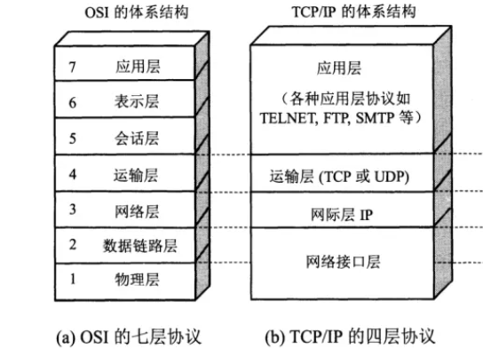
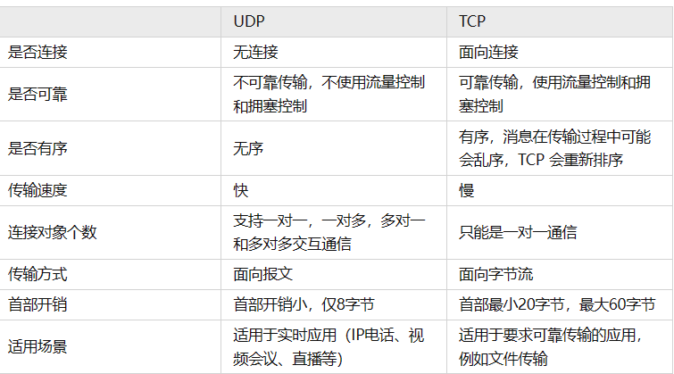
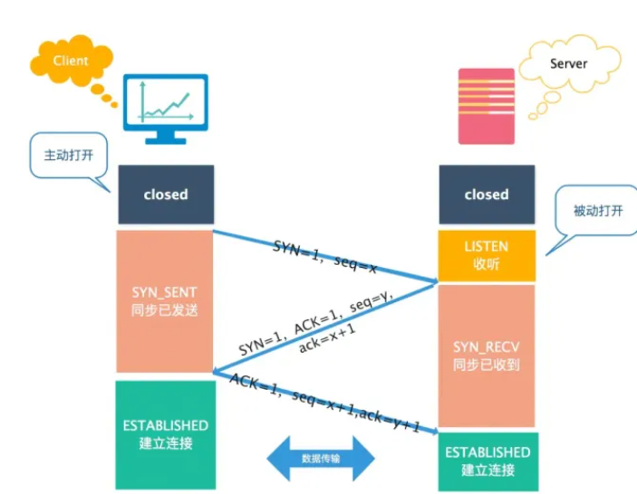
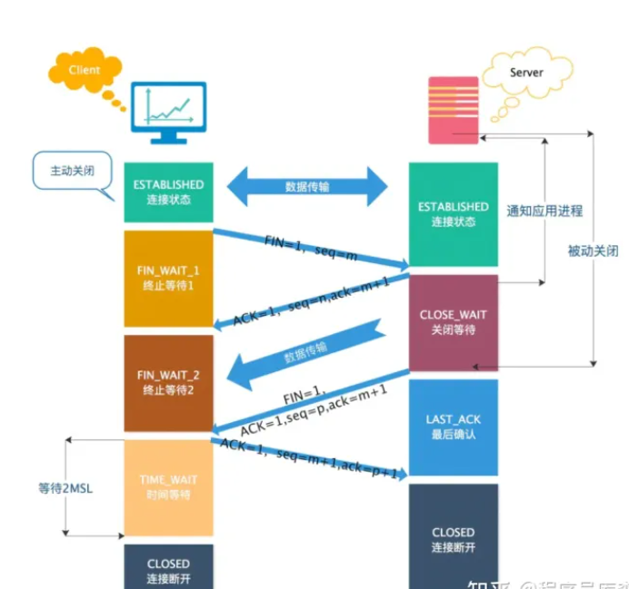
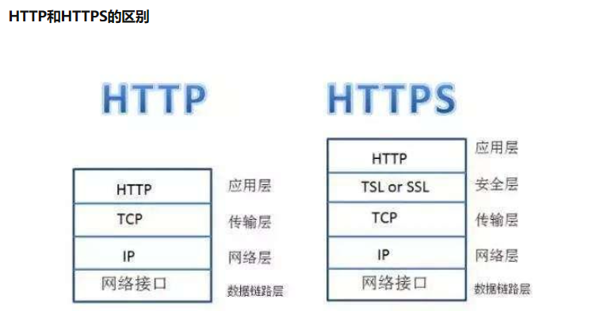

## 1.分层

osi七层结构和TCP/IP四层结构。

osi：

+ 应用层：为应用程序提供交互。包括DNS,HTTP,SMTP。

+ 表示层：负责数据格式转换，如加密解密，压缩解压缩。

+ 会话层：负责在网络中的两结点建立、维持和终止通信。

+ 运输层：向进程提供数据传输服务，TCP/UDP。

+ 网络层：路由选择。IP协议。

+ 链路层：将IP数据包组帧，转发。

+ 物理层：相邻节点比特流透明传输。

## 2.tcp和udp区别

## 3.tcp三次握手

第一次握手：客户端请求连接，发出请求报文(同步信号SYN=1,序号seq取一个随机值x)，然后进入同步已发送状态。

第二次握手：客户端收到请求报文，发出响应报文(SYN=1,确认信号ACK=1,确认号ack=x+1,序号seq取一个随机值y)，然后进入同步已收到状态。

第三次握手：客户端收到响应报文，返回一个确认报文(ACK=1,seq=x+1,ack=y+1)，随后进入建立连接状态。服务器收到确认报文后也进入建立连接状态。

## 4.为什么要三次握手

1. 两次握手的缺点：
   
   假设客户端发出请求A，由于网络原因没有到达服务器；客户端又发出请求B，服务器正常响应，客户端也正常接到响应报文并建立连接，传输数据后客户端进入关闭状态，此时服务器才接到A请求报文，那么客户端无法建立连接并传输数据，服务器会一直等待，造成资源浪费。

2. 不需要四次握手：
   
   第一次握手，服务器确定客户端发送能力和服务器接收能力正常。
   
   第二次握手，客户端确定客户端接收能力和服务器发送能力正常。
   
   第三次握手，双方都确定对方接收发送能力正常。

3. 通过序号和确认号实现可靠数据传输。

## 5.syn洪泛攻击

半连接状态：第二次握手和第三次握手之间。

攻击者伪造大量ip地址发送请求，服务器发出响应，等待这些ip的确认。由于接不到确认报文，服务器会一直重发直到超时，占用了服务器资源，造成网路拥堵。

如何防范：

1. 通过防火墙过滤网关。

2. 缩短超时时间。

3. SYN cookies，接收到TCP SYN包并返回TCP SYN + ACK包时，不分配一个专门的数据区，而是根据这个SYN包计算出一个cookie值。这个
   
   cookie作为将要返回的SYN ACK包的初始序列号。当客户端返回一个ACK包时，根据包头信息计算cookie，与返回的确认序列。

## 6.第三次握手失败后，会发生什么

服务器：根据TCP超时重传机制，重发响应报文。重发指定次数后，关闭这个链接。

客户端：客户端认为连接已建立，向服务器发送数据，服务器返回RST包，客户端就知道第三次握手失败，关闭连接。

## 7.四次挥手

第一次挥手：客户端向服务器发送连接释放请求(FIN=1,seq=m)，客户端进入终止等待1状态。

第二次挥手：服务器向客户端发送确认报文(ACK=1,ack=m+1,seq=n)。客户端到服务器的连接已经释放。服务器进入关闭等待状态。

第三次挥手：服务器向客户端发送连接释放报文(FIN=1,seq=w,ack=m+1)，服务器进入最后确认状态。

第四次挥手：客户端向服务器发送确认报文(ACK=1,seq=m+1,ack=w+1),经过两个最长报文寿命(MSL)后，客户端进入关闭状态。服务器收到报文后进入关闭状态。客户端断开连接后，TCP连接才算释放。

## 8.为什么连接建立要三次握手，连接释放要四次挥手

服务器在收到客户端的 FIN 报文段后，可能还有一些数据要传输，所以不能马上关闭连接，但是会做出应答，返回 ACK 报文段。

完成数据传输后，服务器再发送FIN报文，通知客户端数据已经发送完毕，可以关闭连接。

## 9.为什么四次挥手最后客户端要等待2MSL。

1. 确保ACK报文能到达服务器。如果没有正确到达，服务器会超时重传，若客户端关闭，就无法正确响应。
   
   2MSL计算如下：客户端ACK报文超时 1MSL+服务器传输FIN报文 1MSL。站在服务器角度，如果客户端的ACK报文没有到达，服务器就会重新发送FIN报文，而客户端在第二次FIN报文到达前一定是没有关闭的，客户端接到FIN报文就会重置计时器为2MSL。

2. 在2MSL时间内，使得本次连接发送的所有报文段在网络空间消失。

## 10.TCP可靠传输机制

校验和、序号、滑动窗口、应答、流量控制、拥塞控制。

## 11.GBN,SR,TCP滑动窗口

+ GBN: 发送方连续发送，接收方按需接收。如果失序，发送方从第一个失序帧开始重发。接收方可以累计确认。

        发送窗口大小不大于2^n - 1，否则无法辨识新旧帧(序号用完了)。

        接收窗口为1.

+ SR: 接收方缓存失序帧，发送方只重发出错帧。

        发送窗口和接收窗口大小相同，不超过2^(n-1)。

+ TCP：TCP流量控制实际上采用滑动窗口实现，接收方根据接收缓存的大小，动态调整发送方发送窗口大小，这称为接收窗口rwnd。发送方根据当前网络拥塞程度估计的窗口值为拥塞窗口cwnd。发送窗口的实际大小取rwnd和cwnd的最小值。

## 12.TCP超时重传与拥塞控制

超时重传：TCP每发送一个报文段，就给该报文段设置一个计时器，如果到时还未接到确认报文，就重传。这个重传时限应略大于加权平均往返时延RTTs。

冗余ACK：当接收方收到序号大于期望的报文时，返回一个冗余ACK。发送方连续收到3个相同冗余ACK，直接重传。

拥塞控制：

+ 慢开始：规定一个阈值ssthresh。当cwnd小于ssthresh时，发送方每收到一个正确的确认报文，就将cwnd增加1，这样cwnd随**时间**指数增长(随传输次数线性增长)。

+ 拥塞避免：当cwnd达到ssthresh时，每经过一个RTT将cwnd增加1。

+ 拥塞处理：只要发生拥塞(超时)，就将ssthresh设为此时cwnd的一半，并将cwnd置为1.

快速重传：即上文冗余ACK。

快速恢复：当快速重传后，将ssthresh设为此时cwnd的一半，而cwnd也设为这个值。（跳过慢开始阶段）。

## 13.常见http状态码

- 200：服务器已成功处理了请求。 通常，这表示服务器提供了请求的网页。
- 301 ： (永久移动) 请求的网页已永久移动到新位置。 服务器返回此响应(对 GET 或 HEAD 请求的响应)时，会自动将请求者转到新位置。
- 302：(临时移动) 服务器目前从不同位置的网页响应请求，但请求者应继续使用原有位置来进行以后的请求。
- 400 ：客户端请求有语法错误，不能被服务器所理解。
- 403 ：服务器收到请求，但是拒绝提供服务。(权限)
- 404 ：(未找到) 服务器找不到请求的网页。
- 500： (服务器内部错误) 服务器遇到错误，无法完成请求。

## 14.GET和POST区别

+ GET用url传参，而POST用正文传参。

+ GET传参有长度限制，POST数据可以非常大。

+ GET是幂等性的，POST不是。幂等性是指面对同一URL的多次请求返回相同结果。

## 15.http请求报文和响应报文

**请求报文格式**：

1. 请求行（请求方法+URI协议+版本）
2. 请求头部
3. 空行
4. 请求主体

**响应报文**：

1. 状态行（版本+状态码+原因短语）
2. 响应首部
3. 空行
4. 响应主体

## 16.http1.0和http1.1的区别

1. http1.1支持长连接：Connection:keep-alive。当一个网页打开完成后，客户端和服务器之间用于传输HTTP数据的 TCP连接不会关闭，如果客户端再次访问这个服务器上的网页，会继续使用这一条已经建立的连接。Keep-Alive不会永久保持连接，它有一个保持时间。http1.0默认短连接。

2. 缓存策略不同：http1.0用Expires关键字，它的值为服务端返回的到期时间，即下一次请求时，请求时间小于服务端返回的到期时间，直接使用缓存数据。

# 17.http和https区别

1. 安全性不同
   
   https://前缀表明是用SSL (安全套接字)或TSL加密的

2. 网站申请流程不同
   
   https协议需要到CA申请证书

3. 默认端口不同
   
   http使用的是80端口，https使用的是443端口。

4. 工作在不同层
   
   在网络模型中，HTTP工作于应用层，而HTTPS工作在传输层。
