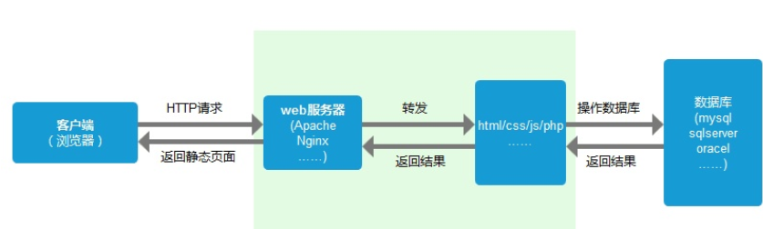
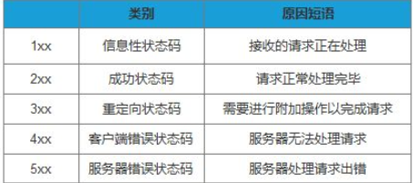

简述：

1. 浏览器解析URL

2. DNS域名解析

3. 浏览器获取端口号

4. TCP建立连接

5. 发送HTTP请求

6. 服务器处理请求

7. 返回响应结果

8. 关闭TCP连接

9. 浏览器加载解析渲

概括版

首先，浏览器向本地DNS服务器发送请求，如果本地没有缓存该域名的IP地址，就需要通过递归或迭代的方式向根域名服务器、顶级域名服务器、权威域名服务器发起查询请求，直至返回一个IP地址给浏览器。然后根据该IP地址建立TCP连接，客户端发送HTTP请求，服务器返回报文，关闭TCP连接，再由浏览器进行解析渲染页面，最后TCP四次挥手结束连接。

# 1.浏览器解析URL

浏览器将url解析为协议，域名(以及端口)和资源路径。

# 2.DNS域名解析

浏览器解析完URL后，解析域名，依次从浏览器、操作系统和路由器中查询DNS缓存，如果都没有命中，就要以递归方式到本地域名服务器去查找，如果还没有命中，就以迭代查询方式依次访问根服务器、顶级域名服务器和权限域名服务器。

最后本地域名服务器将含有域名对应IP地址的响应报文发送给客户端。

这一部分在应用层。

# 3.浏览器获取端口号

根据URL解析得到的协议字段，浏览器确定端口号，http端口号80，https端口号443.

这一部分也在应用层

# 4.建立TCP连接

三次握手，很简单不详细讲。

这一部分在传输层。

# 5.发送HTTP请求

http请求报文格式：

请求行

请求头

空行

正文(post方式)

这一部分在应用层。

# 6.服务器处理请求

静态页面可由nginx服务器自动处理，动态页面涉及前端。

# 7.返回响应结果

http响应报文格式

状态行

响应头

空行

正文

状态码：

# 8.关闭TCP连接

四次挥手。

# 9.浏览器加载渲染
