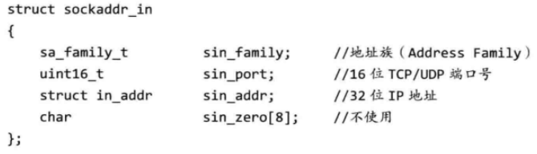

# api介绍

## socket(int af, int type, int protocol)

创建套接字

第一个参数指明通信区域为国际网区域。

第二个参数表示套接字类型，这里使用TCP流式套接字。

第三个参数表示使用的协议，这里用IPPROTO_TCP，表示TCP协议.

返回值是SOCKET类型。

## bind(SOCKET s, const struct sockaddr FAR * name, int namelen)

绑定套接字地址和前面创建的套接字号。

第一个参数是SOCKET返回值，即套接字号。

第二个参数是sockaddr_in类，

```cpp
sockaddr_in addr;
addr.sin_family = AF_INET;
addr.sin_port = htons(80);
addr.sin_addr.S_un.S_addr = htonl(INADDR_ANY);
```

地址族，目标端口和地址信息。



第三个参数是第二个参数长度。

## listen(SOCKET sock, int backlog)

监听套接字，将套接字转换为被动监听状态。

第一个参数是套接字，第二个参数是请求队列最大长度。

成功返回0，失败返回-1.
